# FlexShop — Project Planning Document

> **Phiên bản:** 1.0  
> **Ngày:** 2026-08-31  
> **Nhóm:** 7 thành viên · Thời gian: 1 tháng  
> **Mục tiêu:** MVP Multi-Vendor E-commerce Marketplace

---

## Mục lục

1. [Executive Summary](#1-executive-summary)
2. [Product Vision](#2-product-vision)
3. [Target Users & Roles](#3-target-users--roles)
4. [Functional Scope](#4-functional-scope)
5. [Non-Functional Requirements](#5-non-functional-requirements)
6. [MoSCoW Prioritization](#6-moscow-prioritization)
7. [Epic List](#7-epic-list)
8. [Product Backlog](#8-product-backlog)
9. [User Stories & Acceptance Criteria](#9-user-stories--acceptance-criteria)
10. [Main User Flows](#10-main-user-flows)
11. [Multi-Vendor Business Logic](#11-multi-vendor-business-logic)
12. [Order Lifecycle](#12-order-lifecycle)
13. [Module Breakdown](#13-module-breakdown)
14. [Module Dependency Map](#14-module-dependency-map)
15. [MVP Definition](#15-mvp-definition)
16. [1-Month Roadmap](#16-1-month-roadmap)
17. [Detailed Week 1 Plan](#17-detailed-week-1-plan)
18. [7-Member Team Allocation](#18-7-member-team-allocation)
19. [Definition of Done](#19-definition-of-done)
20. [AI Development Strategy](#20-ai-development-strategy)
21. [Documentation Plan](#21-documentation-plan)
22. [Risk Management](#22-risk-management)
23. [System Acceptance Criteria](#23-system-acceptance-criteria)
24. [Recommended Next Steps](#24-recommended-next-steps)

---

## 1. Executive Summary

**FlexShop** là một hệ thống thương mại điện tử đa gian hàng (Multi-Vendor Marketplace) được xây dựng như đồ án nhóm. Hệ thống lấy cảm hứng từ các sàn thương mại điện tử lớn như Shopee, nhưng **không phải bản sao** mà là phiên bản MVP tập trung vào nghiệp vụ cốt lõi.

### Vấn đề FlexShop giải quyết

| Vấn đề | Giải pháp FlexShop |
|---------|-------------------|
| Người bán lẻ cần kênh bán hàng online | Cung cấp nền tảng tạo gian hàng (Shop) miễn phí |
| Người mua muốn so sánh & mua từ nhiều người bán | Marketplace tập trung với tìm kiếm, lọc, so sánh |
| Quản lý đơn hàng phức tạp khi mua từ nhiều nguồn | Hệ thống Order / ShopOrder tự động tách đơn theo Shop |
| Thiếu sự tin tưởng giữa người mua và người bán | Rating, Review, Complaint, Admin giám sát |

### Phân biệt với website bán hàng thông thường

| Tiêu chí | Website bán hàng thường | FlexShop (Multi-Vendor) |
|----------|------------------------|------------------------|
| Người bán | 1 chủ sở hữu | Nhiều Seller độc lập |
| Catalog sản phẩm | Do 1 bên quản lý | Mỗi Seller quản lý riêng |
| Đơn hàng | 1 đơn → 1 người xử lý | 1 đơn → N ShopOrder → N Seller xử lý |
| Thanh toán | Trả cho 1 bên | Hệ thống trung gian phân phối |
| Quản trị | Admin = chủ shop | Admin = người vận hành sàn |

### Tại sao là Multi-Vendor Marketplace?

Bản chất kinh doanh của FlexShop là **nền tảng trung gian** (platform), không phải nhà bán lẻ:
- Sàn **không sở hữu sản phẩm** — Seller sở hữu.
- Sàn **không xử lý đơn hàng** — Seller xử lý.
- Sàn **quản lý chất lượng, giải quyết tranh chấp, vận hành hạ tầng**.
- Một lần checkout có thể tạo ra **nhiều ShopOrder** gửi tới nhiều Seller khác nhau.

### Các chỉ số chính của dự án

| Metric | Giá trị |
|--------|---------|
| Nhóm | 7 thành viên |
| Thời gian | 4 tuần (1 tháng) |
| Stack | Java / Spring Boot / Thymeleaf / MSSQL |
| Loại sản phẩm | Web-only MVP |
| Mục tiêu | Demo end-to-end, kiến trúc rõ ràng |

---

## 2. Product Vision

### Vision Statement

> **FOR** người mua hàng online và người bán lẻ nhỏ,  
> **WHO** cần một nền tảng thương mại điện tử tập trung, đáng tin cậy,  
> **THE** FlexShop **IS A** Multi-Vendor Marketplace web platform  
> **THAT** cho phép nhiều Seller mở gian hàng, đăng bán sản phẩm, và Customer có thể tìm kiếm, mua hàng từ nhiều Shop trong cùng một đơn hàng.  
> **UNLIKE** các website bán hàng đơn lẻ,  
> **OUR PRODUCT** tập hợp nhiều gian hàng trong một nền tảng, với hệ thống quản lý đơn hàng đa Shop, review, và quản trị bởi Admin.

### Product Goals

1. **End-to-End Shopping Flow**: Customer đăng ký → duyệt sản phẩm → thêm giỏ hàng → checkout → nhận hàng → review.
2. **Multi-Vendor Order Processing**: Một đơn checkout → tách thành nhiều ShopOrder → mỗi Seller xử lý riêng.
3. **Seller Self-Service**: Seller tự tạo Shop, quản lý sản phẩm, xử lý đơn hàng, xem doanh thu.
4. **Admin Governance**: Admin duyệt Shop, quản lý danh mục, giám sát hệ thống, xử lý khiếu nại.
5. **Trust & Engagement**: Rating, Review, Complaint tạo niềm tin cho hệ sinh thái.

---

## 3. Target Users & Roles

Hệ thống có **3 role chính**. Không thêm role phụ (Shipper, Warehouse Staff, etc.) để giữ phạm vi MVP.

---

### 3.1 CUSTOMER

| Thuộc tính | Chi tiết |
|------------|---------|
| **Mục tiêu** | Tìm kiếm, mua sắm sản phẩm từ nhiều Shop trên cùng một nền tảng |
| **Vai trò** | Người mua hàng, người tiêu dùng cuối |
| **Quyền hạn** | Truy cập công khai (browse) + quyền thành viên (mua, review, complaint) |

**Chức năng chính:**
- Đăng ký / Đăng nhập / Quản lý hồ sơ
- Duyệt sản phẩm, tìm kiếm, lọc, sắp xếp
- Xem chi tiết sản phẩm, xem Shop
- Thêm giỏ hàng, chỉnh sửa giỏ
- Checkout (chọn địa chỉ, voucher, phương thức thanh toán)
- Xem danh sách đơn hàng, theo dõi trạng thái
- Xác nhận nhận hàng
- Hủy đơn (trong điều kiện cho phép)

**Chức năng phụ:**
- Wishlist (yêu thích sản phẩm)
- Rating & Review (sau khi nhận hàng)
- Gửi Complaint

**Dữ liệu có thể XEM:** Sản phẩm (tất cả public), Shop info, đơn hàng của mình, review của người khác, trạng thái complaint của mình.

**Dữ liệu có thể TẠO:** Tài khoản, địa chỉ giao hàng, giỏ hàng, đơn hàng, review, complaint, wishlist.

**Dữ liệu có thể SỬA:** Hồ sơ cá nhân, địa chỉ, giỏ hàng (số lượng, xóa item).

**Dữ liệu có thể XÓA:** Địa chỉ, item trong giỏ, item wishlist.

**Hành động bị giới hạn:**
- Không thể xem đơn hàng của Customer khác
- Không thể chỉnh sửa review đã gửi (chỉ tạo 1 lần) — `[DECISION REQUIRED]` Nhóm cần quyết định review có được edit không
- Không thể hủy đơn khi ShopOrder đã chuyển sang SHIPPING
- Không thể truy cập Seller Center hoặc Admin Panel

---

### 3.2 SELLER

| Thuộc tính | Chi tiết |
|------------|---------|
| **Mục tiêu** | Mở gian hàng, bán sản phẩm, quản lý đơn hàng, tăng doanh thu |
| **Vai trò** | Chủ gian hàng (Shop Owner), người cung cấp sản phẩm |
| **Quyền hạn** | Quản lý toàn bộ gian hàng của mình, không can thiệp Shop khác |

**Chức năng chính:**
- Đăng ký Shop (cần Admin duyệt)
- Quản lý thông tin Shop (tên, mô tả, ảnh đại diện)
- Tạo / Sửa / Xóa sản phẩm
- Quản lý biến thể sản phẩm (variant: size, color)
- Quản lý tồn kho (stock)
- Xem & xử lý ShopOrder (confirm, process, ship, complete)
- Xem thống kê doanh thu cơ bản

**Chức năng phụ:**
- Tạo Shop Voucher
- Xem dashboard cơ bản

**Dữ liệu có thể XEM:** Thông tin Shop mình, sản phẩm mình, ShopOrder gửi tới mình, review về sản phẩm mình, thống kê doanh thu mình.

**Dữ liệu có thể TẠO:** Shop, sản phẩm, biến thể, hình ảnh sản phẩm, voucher.

**Dữ liệu có thể SỬA:** Thông tin Shop, sản phẩm, biến thể, stock, trạng thái ShopOrder.

**Dữ liệu có thể XÓA:** Sản phẩm (soft delete), biến thể, hình ảnh, voucher.

**Hành động bị giới hạn:**
- Không thể tự approve Shop (phải chờ Admin)
- Không thể xem/sửa Shop khác hoặc sản phẩm Shop khác
- Không thể xem thông tin Customer ngoài phạm vi đơn hàng
- Không thể hủy ShopOrder sau khi đã giao cho đơn vị vận chuyển
- Không thể truy cập Admin Panel

> **Lưu ý quan trọng:** Một User account có thể vừa là Customer vừa là Seller. Khi User đăng ký Shop và được duyệt, User đó có thêm quyền Seller. Đây là mô hình giống Shopee — không cần tạo account riêng.

---

### 3.3 ADMIN

| Thuộc tính | Chi tiết |
|------------|---------|
| **Mục tiêu** | Vận hành, giám sát, đảm bảo chất lượng toàn hệ thống |
| **Vai trò** | Quản trị viên nền tảng |
| **Quyền hạn** | Super-user: truy cập và quản lý mọi phần của hệ thống |

**Chức năng chính:**
- Quản lý User (xem, tìm kiếm, lock/unlock)
- Quản lý Shop (xem, duyệt, từ chối, tạm ngưng)
- Quản lý Category (tạo, sửa, xóa danh mục toàn sàn)
- Quản lý Product (review, ẩn, xóa sản phẩm vi phạm)
- Giám sát Order (xem tổng quan, theo dõi trạng thái)
- Xử lý Complaint (xem, xử lý, giải quyết)

**Chức năng phụ:**
- Dashboard thống kê (user, shop, product, order, revenue)

**Dữ liệu có thể XEM:** Toàn bộ hệ thống.

**Dữ liệu có thể TẠO:** Category, tài khoản Admin (nếu cần).

**Dữ liệu có thể SỬA:** Trạng thái User (lock/unlock), trạng thái Shop (approve/reject/suspend), trạng thái Product (hide/show), trạng thái Complaint, Category.

**Dữ liệu có thể XÓA:** Category (soft delete), Product vi phạm (soft delete).

**Hành động bị giới hạn:**
- Không thể đặt hàng với tư cách Admin (Admin không phải Customer)
- Không thể tạo sản phẩm (Admin không phải Seller)
- Không thể sửa nội dung sản phẩm (chỉ ẩn/hiện)
- Không thể sửa nội dung đơn hàng (chỉ giám sát)

> `[DECISION REQUIRED]` Admin có thể mua hàng không? Đề xuất: Admin là account riêng, không có chức năng Customer. Nếu nhóm muốn Admin cũng mua hàng, cần dùng account Customer riêng.

---

## 4. Functional Scope

### 4.1 Nghiệp vụ cốt lõi (Core Business)

Đây là những nghiệp vụ **định nghĩa bản chất** Multi-Vendor Marketplace:

1. **Multi-Seller Product Catalog** — Nhiều Seller đăng bán sản phẩm trên cùng nền tảng
2. **Unified Shopping Cart** — Customer bỏ sản phẩm từ nhiều Shop vào cùng 1 giỏ
3. **Multi-Shop Checkout** — 1 lần checkout → tách thành N ShopOrder
4. **Independent Order Processing** — Mỗi Seller xử lý ShopOrder của mình
5. **Admin Governance** — Admin duyệt Shop, giám sát hệ thống

### 4.2 Tính năng bắt buộc (MUST HAVE)

| # | Tính năng | Lý do bắt buộc |
|---|-----------|----------------|
| 1 | Register / Login / Logout | Nền tảng mọi chức năng |
| 2 | User Profile & Address | Cần cho checkout |
| 3 | Category Management (Admin) | Cấu trúc catalog |
| 4 | Shop Registration & Approval | Bản chất multi-vendor |
| 5 | Product CRUD (Seller) | Không có sản phẩm = không có sàn |
| 6 | Product Browsing & Search | Customer phải tìm được hàng |
| 7 | Shopping Cart | Cần để checkout |
| 8 | Multi-Shop Checkout | Nghiệp vụ trung tâm |
| 9 | Order / ShopOrder Management | Xử lý mua bán |
| 10 | Order Status Tracking | Customer theo dõi đơn |
| 11 | Seller Order Processing | Seller xác nhận & xử lý |
| 12 | Admin User/Shop/Product Management | Quản trị nền tảng |

### 4.3 Tính năng nên có (SHOULD HAVE)

| # | Tính năng | Giá trị |
|---|-----------|---------|
| 1 | Product Variants (Size, Color) | Thực tế, sản phẩm cần biến thể |
| 2 | Product Images (multiple) | UX quan trọng |
| 3 | Rating & Review | Tạo niềm tin, engagement |
| 4 | Inventory / Stock Management | Tránh bán quá tồn kho |
| 5 | Basic Seller Dashboard | Seller cần xem doanh thu |
| 6 | Admin Dashboard | Admin cần tổng quan |
| 7 | Complaint | Giải quyết tranh chấp |

### 4.4 Tính năng có thể có (COULD HAVE)

| # | Tính năng | Ghi chú |
|---|-----------|---------|
| 1 | Wishlist | Đơn giản, tăng engagement |
| 2 | Shop Voucher | Tăng tính năng promotion |
| 3 | Sort & Advanced Filter | UX tốt hơn |
| 4 | Order Cancel (Customer) | Cần điều kiện hợp lệ |
| 5 | Review Images | Nâng cao review |

### 4.5 Tính năng KHÔNG làm trong 1 tháng (WON'T HAVE)

| # | Tính năng | Lý do loại |
|---|-----------|-----------|
| 1 | Real-time Chat (Customer ↔ Seller) | Cần WebSocket, quá phức tạp |
| 2 | Real Payment Gateway (VNPay, Momo) | Chỉ mock/simulate |
| 3 | Shipping API Integration | Chỉ mock trạng thái |
| 4 | Push Notification | Cần infrastructure phức tạp |
| 5 | Flash Sale / Live Commerce | Feature phức tạp, ngoài scope |
| 6 | AI Recommendation Engine | Ngoài scope |
| 7 | Mobile App | Web-only |
| 8 | Multi-language / Multi-currency | Phức tạp, không cần cho đồ án |
| 9 | Seller Subscription / Platform Fee | Nghiệp vụ tài chính phức tạp |
| 10 | Return & Refund Flow đầy đủ | Quá phức tạp, chỉ mock ở mức complaint |
| 11 | Social Login (Google, Facebook) | Nice-to-have nhưng mất thời gian |
| 12 | Email Verification / OTP | Cần mail server, phức tạp |
| 13 | Elasticsearch | Dùng SQL LIKE/FTS cho MVP |
| 14 | Microservices Architecture | Monolith phù hợp cho đồ án |
| 15 | CI/CD Pipeline | Deploy thủ công cho đồ án |

---

## 5. Non-Functional Requirements

| Tiêu chí | Yêu cầu MVP | Ghi chú |
|----------|-------------|---------|
| **Performance** | Trang load < 3s trên localhost | Không cần optimize cho production |
| **Security** | Spring Security, role-based access, password hashing | Đủ cho demo |
| **Usability** | UI rõ ràng, responsive cơ bản | Thymeleaf + Bootstrap/CSS |
| **Reliability** | Không mất dữ liệu, xử lý lỗi cơ bản | Try-catch, validation |
| **Scalability** | Không yêu cầu | MVP chạy trên 1 máy |
| **Data Integrity** | Transaction management cho Order/Payment | Quan trọng cho multi-shop order |
| **Browser Support** | Chrome, Firefox (modern browsers) | Không cần IE |

---

## 6. MoSCoW Prioritization

### Tổng quan MoSCoW theo chức năng

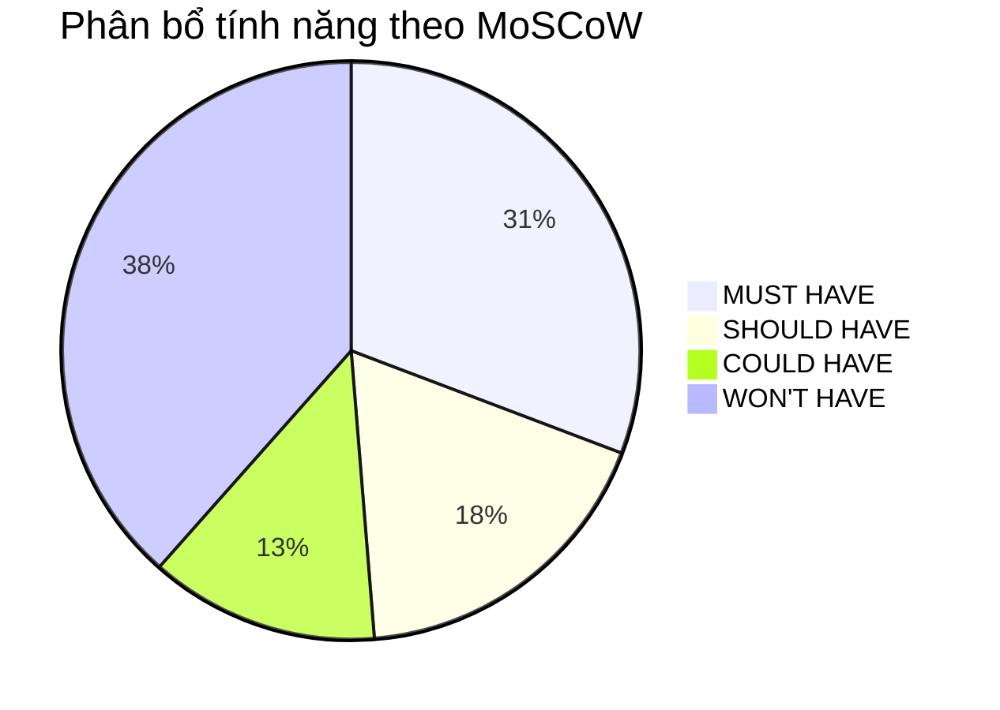

### Chi tiết theo Role

#### Customer Functions

| Chức năng | MoSCoW | Giải thích |
|-----------|--------|-----------|
| Register / Login / Logout | **MUST** | Nền tảng |
| Profile Management | **MUST** | Cần cho checkout |
| Address Management | **MUST** | Cần cho checkout |
| Browse Products (Homepage, Category) | **MUST** | Cốt lõi shopping |
| Search Products | **MUST** | Cốt lõi shopping |
| Filter Products | **COULD** | UX improvement |
| Sort Products | **COULD** | UX improvement |
| View Product Detail | **MUST** | Cốt lõi shopping |
| View Shop Page | **SHOULD** | Hữu ích nhưng không bắt buộc cho flow |
| Add to Cart | **MUST** | Cốt lõi checkout |
| Update Cart Quantity | **MUST** | Cốt lõi checkout |
| Remove Cart Item | **MUST** | Cốt lõi checkout |
| Checkout (Address + Payment) | **MUST** | Cốt lõi |
| Apply Voucher | **COULD** | Promotion |
| View Orders | **MUST** | Theo dõi đơn |
| View Order Detail | **MUST** | Theo dõi đơn |
| Cancel Order | **COULD** | Có điều kiện |
| Confirm Received | **MUST** | Hoàn thành flow |
| Rating & Review | **SHOULD** | Engagement |
| Review with Images | **COULD** | Enhancement |
| Wishlist | **COULD** | Enhancement |
| Complaint | **SHOULD** | Trust |

#### Seller Functions

| Chức năng | MoSCoW | Giải thích |
|-----------|--------|-----------|
| Register Shop | **MUST** | Bản chất multi-vendor |
| Shop Profile | **MUST** | Identity |
| Create Product | **MUST** | Cốt lõi |
| Update Product | **MUST** | Quản lý |
| Delete Product | **MUST** | Quản lý |
| Product Images | **SHOULD** | UX quan trọng |
| Product Variants | **SHOULD** | Thực tế |
| Stock Management | **SHOULD** | Tránh oversell |
| View ShopOrders | **MUST** | Xử lý đơn |
| Confirm ShopOrder | **MUST** | Xử lý đơn |
| Update Shipping Status | **MUST** | Xử lý đơn |
| Shop Voucher | **COULD** | Promotion |
| Revenue Statistics | **SHOULD** | Seller insight |
| Basic Dashboard | **SHOULD** | Overview |

#### Admin Functions

| Chức năng | MoSCoW | Giải thích |
|-----------|--------|-----------|
| View / Search Users | **MUST** | Quản trị |
| Lock / Unlock Users | **MUST** | An ninh |
| View Shops | **MUST** | Quản trị |
| Approve / Reject Shop | **MUST** | Bản chất multi-vendor |
| Suspend Shop | **SHOULD** | An ninh |
| Category CRUD | **MUST** | Cấu trúc catalog |
| Product Review / Hide / Remove | **SHOULD** | Chất lượng |
| View Orders | **SHOULD** | Giám sát |
| View / Process Complaint | **SHOULD** | Trust |
| Dashboard | **SHOULD** | Overview |

---

## 7. Epic List

| Epic ID | Tên Epic | Mô tả | Priority |
|---------|----------|--------|----------|
| EPIC-01 | Authentication & User Management | Đăng ký, đăng nhập, quản lý profile, địa chỉ | MUST |
| EPIC-02 | Shop Management | Đăng ký Shop, duyệt Shop, quản lý Shop profile | MUST |
| EPIC-03 | Category Management | Admin quản lý danh mục sản phẩm toàn sàn | MUST |
| EPIC-04 | Product Catalog | Seller CRUD sản phẩm, Customer browse/search | MUST |
| EPIC-05 | Shopping Cart | Giỏ hàng đa Shop | MUST |
| EPIC-06 | Checkout & Order Creation | Checkout, tách ShopOrder, thanh toán (mock) | MUST |
| EPIC-07 | Order & ShopOrder Management | Quản lý đơn hàng, xử lý ShopOrder | MUST |
| EPIC-08 | Shipping & Delivery | Trạng thái giao hàng (mock) | MUST |
| EPIC-09 | Review & Rating | Đánh giá sản phẩm sau mua | SHOULD |
| EPIC-10 | Voucher & Promotion | Shop voucher | COULD |
| EPIC-11 | Wishlist | Danh sách yêu thích | COULD |
| EPIC-12 | Complaint Management | Customer complaint, Admin xử lý | SHOULD |
| EPIC-13 | Admin Panel | Admin quản lý toàn hệ thống | MUST |
| EPIC-14 | Dashboard & Statistics | Thống kê cho Seller và Admin | SHOULD |

> **Ghi chú:** EPIC-07 (Payment) và EPIC-08 (Shipping) gộp vào Order flow thay vì tách riêng, vì MVP chỉ mock payment/shipping — không tích hợp gateway thật.

---

## 8. Product Backlog

### EPIC-01: Authentication & User Management

| ID | Feature | User Story | Priority | SP | Sprint |
|----|---------|-----------|----------|-----|--------|
| US-01 | Register | As a Customer, I want to register an account with email and password, so that I can access the platform | MUST | 3 | S1 |
| US-02 | Login | As a User, I want to login with my credentials, so that I can access my account | MUST | 2 | S1 |
| US-03 | Logout | As a User, I want to logout, so that my session is securely ended | MUST | 1 | S1 |
| US-04 | View Profile | As a User, I want to view my profile, so that I can see my information | MUST | 2 | S1 |
| US-05 | Edit Profile | As a User, I want to edit my profile (name, phone, avatar), so that I can keep my info up to date | MUST | 3 | S1 |
| US-06 | Manage Addresses | As a Customer, I want to add/edit/delete shipping addresses, so that I can use them during checkout | MUST | 3 | S1 |
| US-07 | Change Password | As a User, I want to change my password, so that I can maintain security | SHOULD | 2 | S2 |

---

### EPIC-02: Shop Management

| ID | Feature | User Story | Priority | SP | Sprint |
|----|---------|-----------|----------|-----|--------|
| US-08 | Register Shop | As a User, I want to register a Shop with name, description, and logo, so that I can become a Seller | MUST | 5 | S1 |
| US-09 | Shop Approval | As an Admin, I want to review and approve/reject Shop registration, so that only legitimate sellers operate | MUST | 3 | S1 |
| US-10 | View Shop Profile | As a Customer, I want to view a Shop's profile and product listing, so that I can browse their offerings | SHOULD | 3 | S2 |
| US-11 | Edit Shop Profile | As a Seller, I want to update my Shop's name, description, and logo, so that I can maintain my brand | MUST | 2 | S2 |
| US-12 | Suspend Shop | As an Admin, I want to suspend a Shop, so that I can enforce platform policies | SHOULD | 2 | S3 |

---

### EPIC-03: Category Management

| ID | Feature | User Story | Priority | SP | Sprint |
|----|---------|-----------|----------|-----|--------|
| US-13 | Create Category | As an Admin, I want to create product categories (with parent-child hierarchy), so that products are organized | MUST | 3 | S1 |
| US-14 | Update Category | As an Admin, I want to update category names and hierarchy, so that the catalog stays organized | MUST | 2 | S1 |
| US-15 | Delete Category | As an Admin, I want to delete empty categories, so that the catalog stays clean | MUST | 2 | S1 |
| US-16 | Browse by Category | As a Customer, I want to browse products by category, so that I can find products easily | MUST | 3 | S2 |

---

### EPIC-04: Product Catalog

| ID | Feature | User Story | Priority | SP | Sprint |
|----|---------|-----------|----------|-----|--------|
| US-17 | Create Product | As a Seller, I want to create a product with name, description, price, and category, so that customers can find and buy it | MUST | 5 | S2 |
| US-18 | Upload Product Images | As a Seller, I want to upload multiple images for a product, so that customers can see what they're buying | SHOULD | 3 | S2 |
| US-19 | Create Product Variants | As a Seller, I want to add variants (size, color) with individual prices and stock, so that I can sell different options | SHOULD | 5 | S2 |
| US-20 | Update Product | As a Seller, I want to update my product's information, so that it stays accurate | MUST | 3 | S2 |
| US-21 | Delete Product | As a Seller, I want to delete (deactivate) a product, so that it's no longer listed | MUST | 2 | S2 |
| US-22 | View Product List (Homepage) | As a Customer, I want to see a list of products on the homepage, so that I can discover products | MUST | 3 | S2 |
| US-23 | Search Products | As a Customer, I want to search products by keyword, so that I can find what I need | MUST | 3 | S2 |
| US-24 | View Product Detail | As a Customer, I want to view a product's detail (images, description, price, variants, reviews), so that I can decide to buy | MUST | 5 | S2 |
| US-25 | Filter Products | As a Customer, I want to filter products by price range and category, so that I can narrow results | COULD | 3 | S3 |
| US-26 | Sort Products | As a Customer, I want to sort products by price, newest, best-selling, so that I can find what I want faster | COULD | 2 | S3 |

---

### EPIC-05: Shopping Cart

| ID | Feature | User Story | Priority | SP | Sprint |
|----|---------|-----------|----------|-----|--------|
| US-27 | Add to Cart | As a Customer, I want to add a product (with variant) to my cart, so that I can purchase it later | MUST | 5 | S2 |
| US-28 | View Cart | As a Customer, I want to view my cart grouped by Shop, so that I can see what I'm buying from each seller | MUST | 3 | S2 |
| US-29 | Update Cart Quantity | As a Customer, I want to change the quantity of items in my cart, so that I can buy the right amount | MUST | 2 | S2 |
| US-30 | Remove Cart Item | As a Customer, I want to remove items from my cart, so that I can change my mind | MUST | 1 | S2 |
| US-31 | Select Cart Items | As a Customer, I want to select specific items in my cart for checkout, so that I don't have to buy everything at once | SHOULD | 3 | S3 |

---

### EPIC-06: Checkout & Order Creation

| ID | Feature | User Story | Priority | SP | Sprint |
|----|---------|-----------|----------|-----|--------|
| US-32 | Checkout Page | As a Customer, I want to see a checkout summary with items grouped by Shop, shipping address, and total, so that I can confirm before paying | MUST | 5 | S3 |
| US-33 | Select Shipping Address | As a Customer, I want to select a shipping address during checkout, so that my order is delivered correctly | MUST | 2 | S3 |
| US-34 | Select Payment Method | As a Customer, I want to select a payment method (COD or mock online payment), so that I can pay for my order | MUST | 3 | S3 |
| US-35 | Place Order (Multi-Shop) | As a Customer, I want to place an order that automatically creates separate ShopOrders for each Shop, so that each seller can process their items independently | MUST | 8 | S3 |
| US-36 | Apply Voucher | As a Customer, I want to apply a Shop voucher during checkout, so that I can get a discount | COULD | 5 | S4 |

---

### EPIC-07: Order & ShopOrder Management

| ID | Feature | User Story | Priority | SP | Sprint |
|----|---------|-----------|----------|-----|--------|
| US-37 | View My Orders | As a Customer, I want to view a list of my orders with status, so that I can track my purchases | MUST | 3 | S3 |
| US-38 | View Order Detail | As a Customer, I want to view order detail with ShopOrder breakdown, items, and status per Shop, so that I know the status from each seller | MUST | 5 | S3 |
| US-39 | Cancel Order | As a Customer, I want to cancel my order (or individual ShopOrder) when it's still in PENDING status, so that I can change my mind | COULD | 3 | S3 |
| US-40 | Seller View ShopOrders | As a Seller, I want to view all ShopOrders for my Shop, so that I can manage them | MUST | 3 | S3 |
| US-41 | Seller Confirm ShopOrder | As a Seller, I want to confirm a ShopOrder, so that I start processing it | MUST | 3 | S3 |
| US-42 | Seller Ship ShopOrder | As a Seller, I want to mark a ShopOrder as shipped (with tracking info), so that the customer knows it's on the way | MUST | 3 | S3 |
| US-43 | Customer Confirm Received | As a Customer, I want to confirm I received my items, so that the ShopOrder is completed | MUST | 2 | S3 |
| US-44 | Admin View All Orders | As an Admin, I want to view all orders in the system, so that I can monitor the marketplace | SHOULD | 3 | S4 |

---

### EPIC-08: Shipping & Delivery (Mock)

> **Ghi chú:** Shipping trong MVP là mock — không tích hợp API vận chuyển thật. Trạng thái shipping được Seller cập nhật thủ công.

| ID | Feature | User Story | Priority | SP | Sprint |
|----|---------|-----------|----------|-----|--------|
| US-45 | Mock Shipping Method | As a Customer, I want to see a shipping method (flat rate or free) during checkout, so that I know the delivery cost | MUST | 2 | S3 |
| US-46 | Track Shipping Status | As a Customer, I want to see the shipping status of my ShopOrder, so that I know when to expect delivery | MUST | 2 | S3 |

---

### EPIC-09: Review & Rating

| ID | Feature | User Story | Priority | SP | Sprint |
|----|---------|-----------|----------|-----|--------|
| US-47 | Submit Review | As a Customer, I want to rate (1-5 stars) and write a review for a product after I received it, so that I can share my experience | SHOULD | 5 | S4 |
| US-48 | View Reviews | As a Customer, I want to see reviews and ratings on a product detail page, so that I can make informed decisions | SHOULD | 3 | S4 |
| US-49 | Review Images | As a Customer, I want to upload images with my review, so that I can show the actual product | COULD | 3 | S4 |

---

### EPIC-10: Voucher & Promotion

| ID | Feature | User Story | Priority | SP | Sprint |
|----|---------|-----------|----------|-----|--------|
| US-50 | Create Shop Voucher | As a Seller, I want to create discount vouchers for my Shop, so that I can attract customers | COULD | 5 | S4 |
| US-51 | Apply Shop Voucher | As a Customer, I want to apply a Shop voucher during checkout, so that I get a discount on items from that Shop | COULD | 5 | S4 |

---

### EPIC-11: Wishlist

| ID | Feature | User Story | Priority | SP | Sprint |
|----|---------|-----------|----------|-----|--------|
| US-52 | Add to Wishlist | As a Customer, I want to save products to my wishlist, so that I can buy them later | COULD | 2 | S4 |
| US-53 | View Wishlist | As a Customer, I want to view my wishlist, so that I can find saved products | COULD | 2 | S4 |
| US-54 | Remove from Wishlist | As a Customer, I want to remove products from my wishlist, so that I can manage my saved items | COULD | 1 | S4 |

---

### EPIC-12: Complaint Management

| ID | Feature | User Story | Priority | SP | Sprint |
|----|---------|-----------|----------|-----|--------|
| US-55 | Submit Complaint | As a Customer, I want to submit a complaint about an order/product, so that I can report issues | SHOULD | 3 | S4 |
| US-56 | View My Complaints | As a Customer, I want to view my complaints and their status, so that I can track resolution | SHOULD | 2 | S4 |
| US-57 | Admin View Complaints | As an Admin, I want to view all complaints, so that I can manage disputes | SHOULD | 3 | S4 |
| US-58 | Admin Process Complaint | As an Admin, I want to process and resolve complaints, so that platform trust is maintained | SHOULD | 3 | S4 |

---

### EPIC-13: Admin Panel

| ID | Feature | User Story | Priority | SP | Sprint |
|----|---------|-----------|----------|-----|--------|
| US-59 | Admin User List | As an Admin, I want to view and search users, so that I can manage the user base | MUST | 3 | S2 |
| US-60 | Admin Lock/Unlock User | As an Admin, I want to lock/unlock user accounts, so that I can enforce policies | MUST | 2 | S2 |
| US-61 | Admin Product Management | As an Admin, I want to review, hide, or remove products, so that I can maintain catalog quality | SHOULD | 3 | S3 |

---

### EPIC-14: Dashboard & Statistics

| ID | Feature | User Story | Priority | SP | Sprint |
|----|---------|-----------|----------|-----|--------|
| US-62 | Seller Dashboard | As a Seller, I want to see basic statistics (revenue, orders count, product count), so that I can track my business | SHOULD | 5 | S4 |
| US-63 | Admin Dashboard | As an Admin, I want to see platform statistics (users, shops, products, orders, revenue), so that I can monitor the marketplace | SHOULD | 5 | S4 |

---

### Backlog Summary

| Sprint | MUST Stories | SHOULD Stories | COULD Stories | Total SP |
|--------|-------------|---------------|---------------|----------|
| S1 (Week 1-2) | US-01 → US-06, US-08, US-09, US-13 → US-15 | US-07 | — | ~31 |
| S2 (Week 2-3) | US-10, US-11, US-16 → US-24, US-27 → US-30, US-59, US-60 | US-18, US-19, US-31 | — | ~56 |
| S3 (Week 3) | US-32 → US-35, US-37, US-38, US-40 → US-43, US-45, US-46 | US-12, US-44, US-61 | US-25, US-26, US-36, US-39 | ~55 |
| S4 (Week 4) | — | US-47, US-48, US-55 → US-58, US-62, US-63 | US-36, US-49 → US-54 | ~47 |

> **Tổng:** ~189 Story Points cho 7 người trong 4 tuần ≈ ~6.75 SP/người/tuần — khả thi nhưng cần quản lý tốt.

---

## 9. User Stories & Acceptance Criteria

### Các User Story quan trọng nhất (chi tiết)

#### US-01: Customer Register

**Story:** As a Customer, I want to register an account with email and password, so that I can access the platform.

**Acceptance Criteria:**
1. Trang đăng ký yêu cầu: email, password, confirm password, full name, phone number
2. Email phải unique trong hệ thống
3. Password tối thiểu 8 ký tự
4. Password và confirm password phải khớp
5. Sau đăng ký thành công, redirect về trang login với message thành công
6. Nếu email đã tồn tại, hiển thị lỗi rõ ràng
7. Tất cả field bắt buộc phải validate cả client-side và server-side

---

#### US-08: Register Shop

**Story:** As a User, I want to register a Shop with name, description, and logo, so that I can become a Seller.

**Acceptance Criteria:**
1. User đã đăng nhập mới có thể đăng ký Shop
2. Một User chỉ được đăng ký 1 Shop
3. Form yêu cầu: shop name (unique), description, logo image
4. Sau submit, Shop có trạng thái PENDING
5. User nhận thông báo "Đang chờ duyệt"
6. User không thể đăng sản phẩm khi Shop chưa APPROVED

---

#### US-09: Admin Approve/Reject Shop

**Story:** As an Admin, I want to review and approve/reject Shop registrations, so that only legitimate sellers can operate.

**Acceptance Criteria:**
1. Admin thấy danh sách Shop có trạng thái PENDING
2. Admin có thể xem chi tiết thông tin Shop
3. Admin có thể Approve → Shop chuyển sang ACTIVE
4. Admin có thể Reject → Shop chuyển sang REJECTED (có reason)
5. Sau khi được Approve, Seller có thể bắt đầu tạo sản phẩm

---

#### US-35: Place Order (Multi-Shop) ⭐ QUAN TRỌNG NHẤT

**Story:** As a Customer, I want to place an order that automatically creates separate ShopOrders for each Shop, so that each seller can process their items independently.

**Acceptance Criteria:**
1. Customer chọn items từ cart (có thể từ nhiều Shop)
2. Hệ thống hiển thị checkout page với items grouped by Shop
3. Customer chọn địa chỉ giao hàng
4. Customer chọn phương thức thanh toán (COD hoặc mock online)
5. Khi confirm, hệ thống tạo:
   - 1 Order (parent) với tổng tiền
   - N ShopOrder (con) cho mỗi Shop liên quan
   - Mỗi ShopOrder chứa OrderItem thuộc Shop đó
6. Mỗi ShopOrder có trạng thái PENDING ban đầu
7. Stock được giảm tương ứng (nếu có variant, giảm stock variant)
8. Cart items đã checkout bị xóa khỏi cart
9. Nếu stock không đủ, hiển thị lỗi trước khi tạo order
10. Transaction đảm bảo: nếu lỗi, không tạo order nào cả (rollback)

---

#### US-41: Seller Confirm ShopOrder

**Story:** As a Seller, I want to confirm a ShopOrder, so that I start processing it.

**Acceptance Criteria:**
1. Seller thấy danh sách ShopOrder trạng thái PENDING cho Shop mình
2. Seller xem chi tiết ShopOrder (items, customer address, total)
3. Seller click "Confirm" → ShopOrder chuyển sang CONFIRMED
4. Seller không thể confirm ShopOrder đã CANCELLED
5. `[DECISION REQUIRED]` Seller có thể reject ShopOrder không? Nếu có, cần lý do.

---

#### US-43: Customer Confirm Received

**Story:** As a Customer, I want to confirm I received my items, so that the ShopOrder is completed.

**Acceptance Criteria:**
1. Customer chỉ thấy nút "Confirm Received" khi ShopOrder ở trạng thái SHIPPED
2. Click "Confirm Received" → ShopOrder chuyển sang DELIVERED
3. Khi tất cả ShopOrder trong Order đều DELIVERED, Order chuyển sang COMPLETED
4. Sau confirm, Customer có thể viết Review cho sản phẩm trong đơn

---

## 10. Main User Flows

### FLOW 1: Customer Register / Login

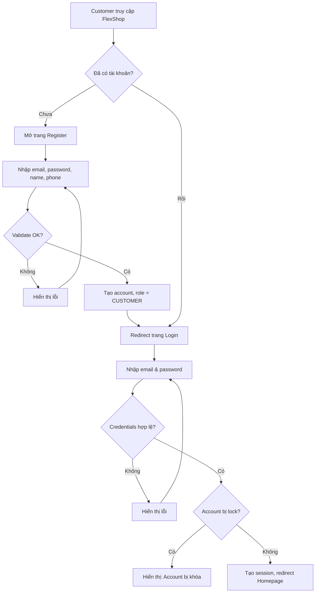

---

### FLOW 2: Seller Register Shop

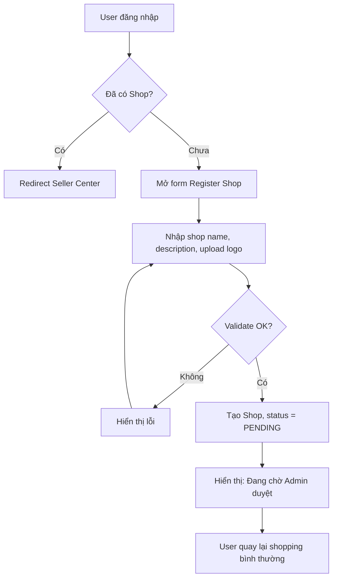

---

### FLOW 3: Admin Approve Shop

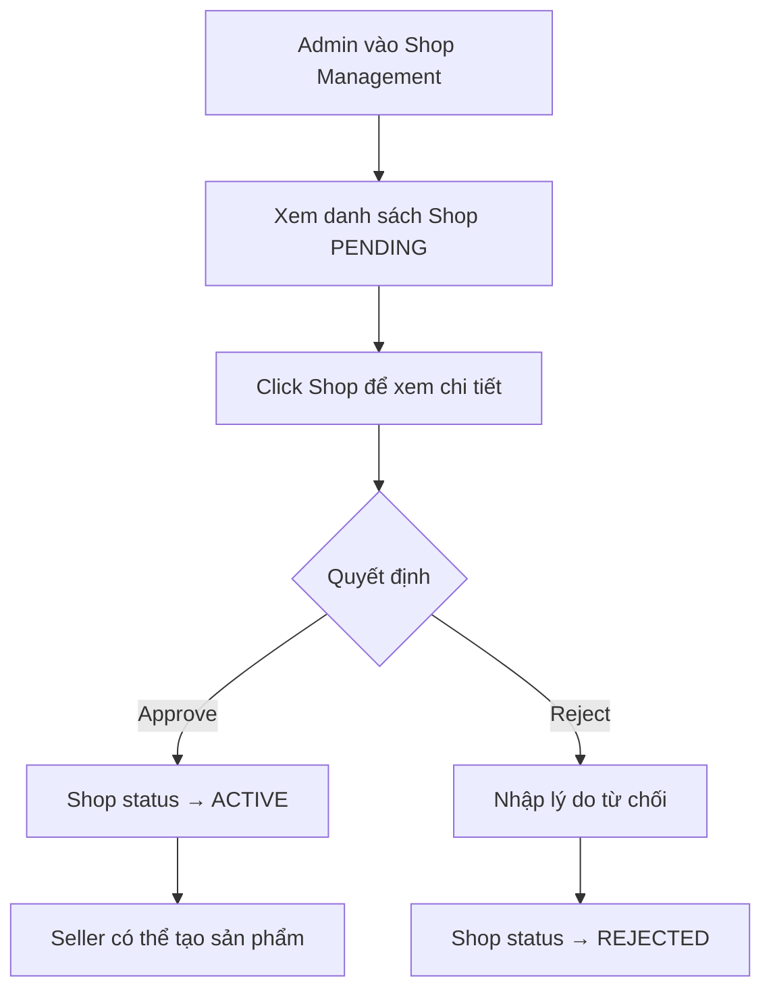

---

### FLOW 4: Seller Create Product

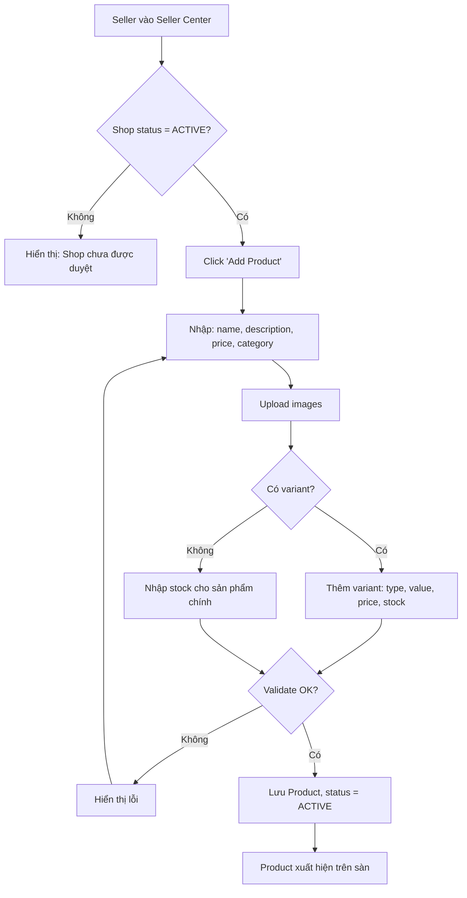

---

### FLOW 5: Customer Search Product

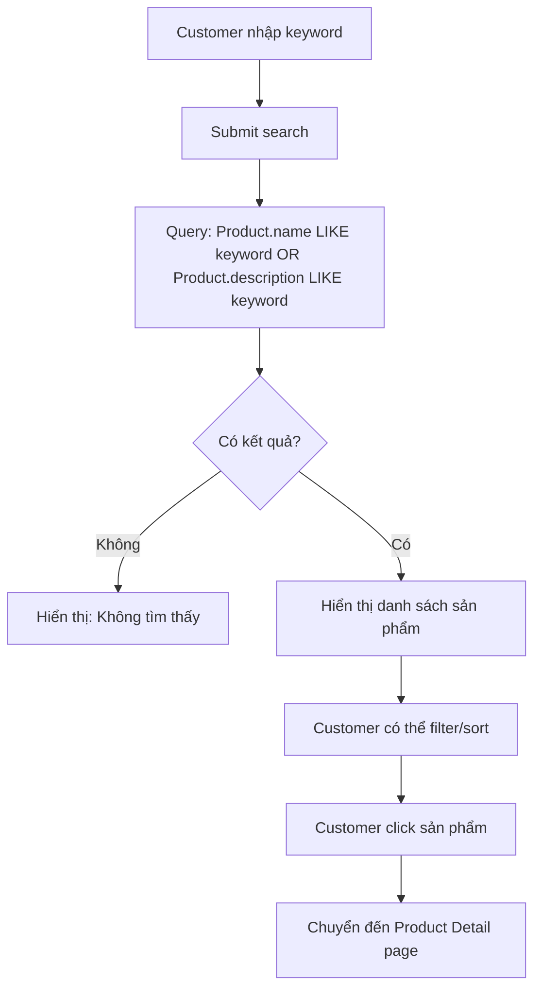

---

### FLOW 6: Customer Add Product To Cart

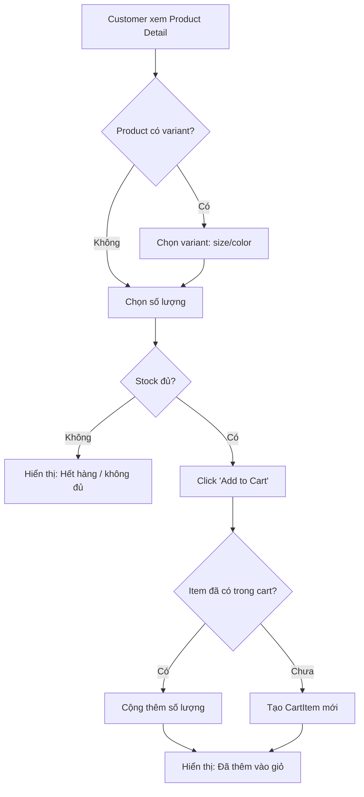

---

### FLOW 7: Customer Checkout (Single Shop)

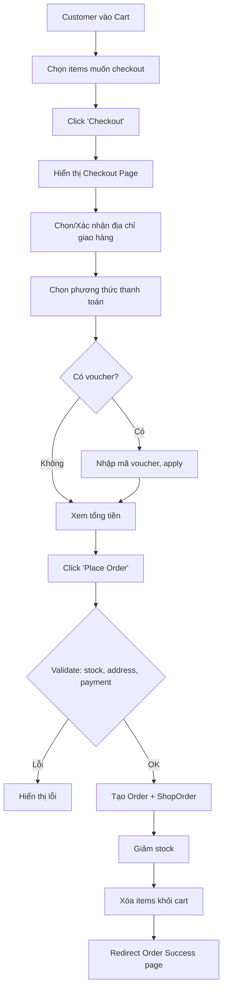

---

### FLOW 8: Customer mua sản phẩm từ nhiều Shop ⭐

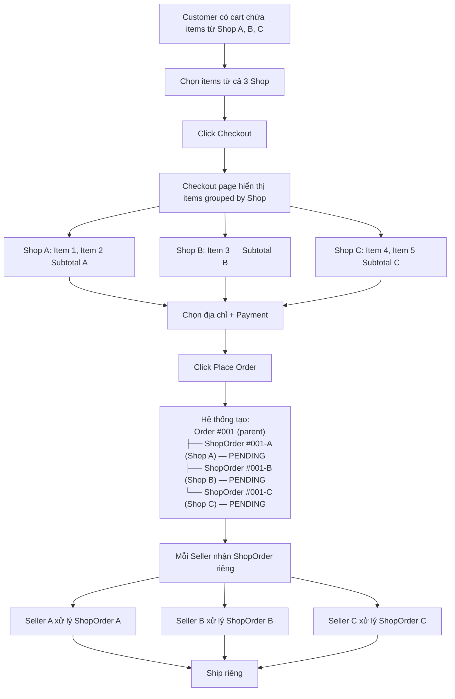

---

### FLOW 9: Seller xử lý ShopOrder

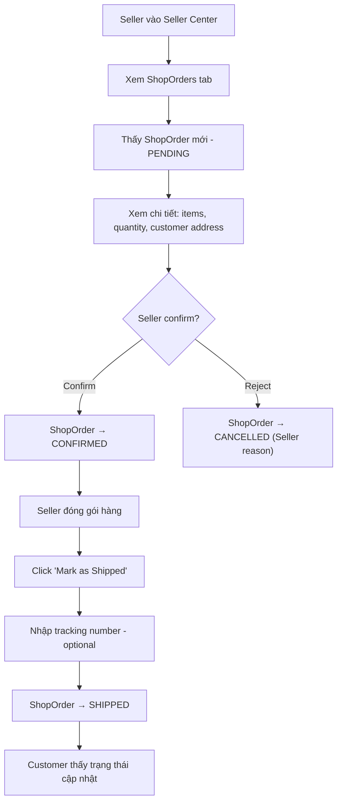

---

### FLOW 10: Order Shipping (Mock)

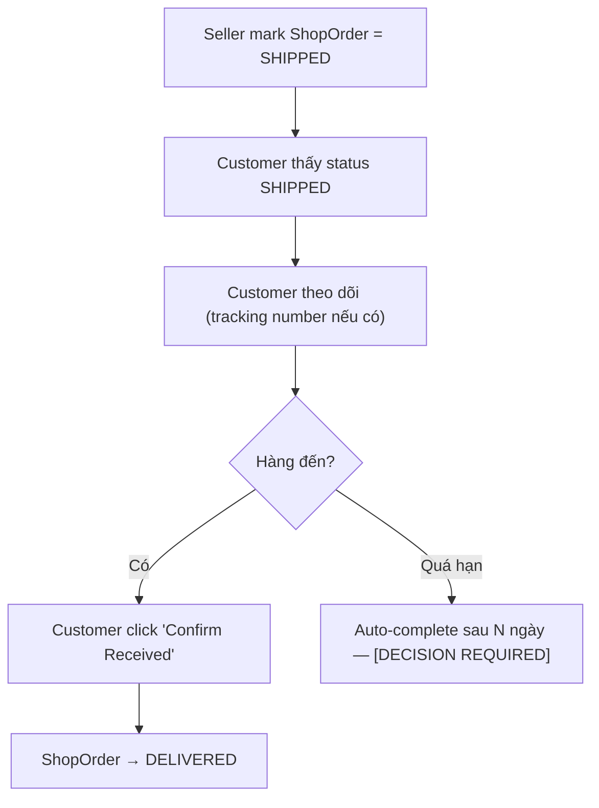

> `[DECISION REQUIRED]` Có nên auto-complete ShopOrder sau N ngày kể từ SHIPPED không? Shopee auto-confirm sau 7 ngày. MVP có thể bỏ qua auto-complete và chỉ hỗ trợ manual confirm.

---

### FLOW 11: Customer nhận hàng

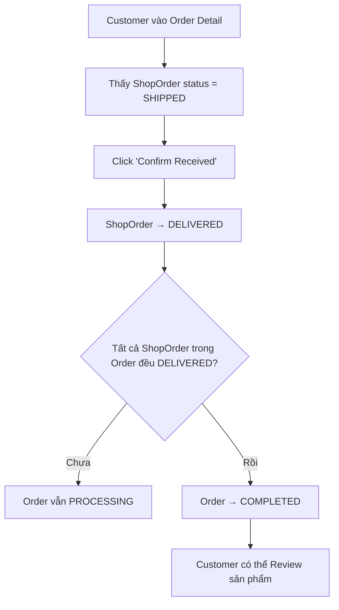

---

### FLOW 12: Customer Review

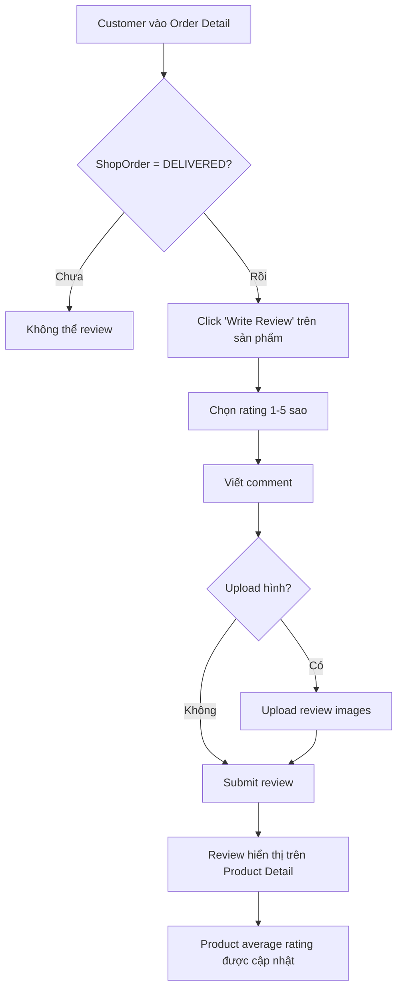

---

### FLOW 13: Customer Complaint

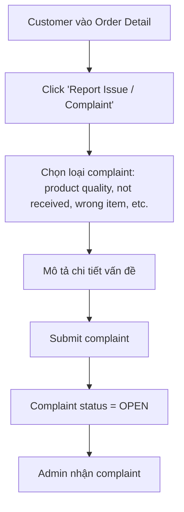

---

### FLOW 14: Admin xử lý Complaint

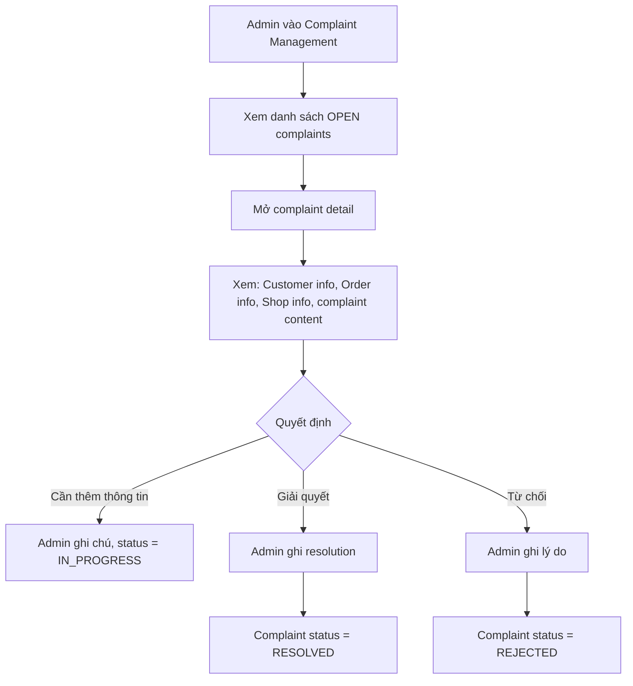

---

## 11. Multi-Vendor Business Logic

### 11.1 Tại sao cần Order và ShopOrder?

Trong một marketplace multi-vendor, khi Customer checkout cart chứa sản phẩm từ nhiều Shop, hệ thống phải giải quyết một thực tế: **mỗi Shop xử lý đơn hàng độc lập**. Shop A đóng gói và giao hàng riêng, Shop B cũng vậy.

Do đó cần **2 cấp đơn hàng**:

```
Order (Parent) — Đại diện cho lần checkout của Customer
├── ShopOrder A — Phần đơn hàng mà Shop A cần xử lý
│   ├── OrderItem 1 (Product from Shop A)
│   └── OrderItem 2 (Product from Shop A)
├── ShopOrder B — Phần đơn hàng mà Shop B cần xử lý
│   └── OrderItem 3 (Product from Shop B)
└── ShopOrder C — Phần đơn hàng mà Shop C cần xử lý
    ├── OrderItem 4 (Product from Shop C)
    └── OrderItem 5 (Product from Shop C)
```

| Concept | Thuộc về | Mục đích |
|---------|----------|----------|
| **Order** | Customer | Tổng hợp toàn bộ lần checkout: tổng tiền, địa chỉ, payment |
| **ShopOrder** | Shop (Seller) | Phần đơn hàng của 1 Shop cụ thể: items, subtotal, shipping |
| **OrderItem** | ShopOrder | 1 dòng sản phẩm cụ thể: product, variant, quantity, price |

### 11.2 Quy trình Checkout chi tiết

```
1. Customer chọn items trong Cart → Click "Checkout"
2. Hệ thống nhóm items theo Shop
3. Với mỗi nhóm Shop:
   a. Tính subtotal (sum of item prices × quantities)
   b. Tính shipping fee (mock: flat rate per Shop)
   c. Apply voucher nếu có (per Shop)
4. Tổng Order = Sum of all ShopOrder totals + shipping fees
5. Customer confirm address + payment method
6. Click "Place Order"
7. BEGIN TRANSACTION
   a. Validate stock cho tất cả items
   b. Tạo Order (parent)
   c. Tạo ShopOrder cho mỗi Shop
   d. Tạo OrderItem cho mỗi sản phẩm
   e. Giảm stock tương ứng
   f. Xóa items khỏi Cart
   g. Ghi nhận payment (mock)
   h. COMMIT
8. Redirect "Order Success" page
```

### 11.3 Quy trình thanh toán (Mock)

MVP không tích hợp payment gateway thật. Hai phương thức:

| Phương thức | Hành vi |
|-------------|---------|
| **COD** (Cash on Delivery) | Order được tạo, payment status = PENDING. Khi Customer confirm received → payment status = PAID |
| **Mock Online Payment** | Simulate payment success immediately. Payment status = PAID ngay khi checkout |

> `[DECISION REQUIRED]` Nhóm có muốn implement cả COD lẫn mock online, hay chỉ 1? Đề xuất: implement cả 2 vì logic đơn giản và demo tốt hơn.

### 11.4 Quy trình xử lý đơn của từng Shop

```
Seller nhận ShopOrder (PENDING)
  → Seller xem chi tiết (items, address)
  → Seller Confirm → CONFIRMED
  → Seller đóng gói → Mark as Shipped → SHIPPED
  → Customer nhận hàng → Confirm Received → DELIVERED
```

Mỗi Seller **chỉ thấy và xử lý ShopOrder của Shop mình**. Seller A không thể thấy ShopOrder gửi cho Seller B.

### 11.5 Quy trình giao hàng (Mock)

Không tích hợp API vận chuyển. Quy trình mock:
1. Seller click "Mark as Shipped" và nhập tracking number (optional text field)
2. ShopOrder chuyển sang SHIPPED
3. Customer thấy trạng thái SHIPPED
4. Customer click "Confirm Received" → DELIVERED

### 11.6 Hủy đơn

| Ai hủy | Khi nào | Điều kiện | Hệ quả |
|--------|---------|-----------|---------|
| Customer | PENDING | ShopOrder chưa được Seller confirm | ShopOrder → CANCELLED, hoàn stock |
| Seller | PENDING | Seller reject ShopOrder | ShopOrder → CANCELLED, hoàn stock |
| Không ai | CONFIRMED / SHIPPED | Đã xử lý, không thể hủy | Customer phải dùng Complaint |

> `[DECISION REQUIRED]` Khi Customer hủy 1 ShopOrder trong Order có nhiều ShopOrder:
> - **Option A:** Chỉ hủy ShopOrder đó, Order vẫn active (các ShopOrder khác không ảnh hưởng)
> - **Option B:** Hủy toàn bộ Order
> - **Recommendation:** Option A — phù hợp với multi-vendor logic, từng Shop độc lập.

### 11.7 Hoàn thành đơn

```
ShopOrder A → DELIVERED ✓
ShopOrder B → DELIVERED ✓
ShopOrder C → DELIVERED ✓
───────────────────────────
Order → COMPLETED ✓
```

Order chỉ COMPLETED khi **tất cả** ShopOrder đều DELIVERED hoặc CANCELLED. Nếu có mix (một số DELIVERED, một số CANCELLED), Order vẫn COMPLETED nhưng có thể ghi nhận trạng thái partial.

---

## 12. Order Lifecycle

### 12.1 Order Status (Parent Order)

```mermaid
statechart-v2
```

Vì Mermaid statechart có hạn chế, mô tả bằng flow:

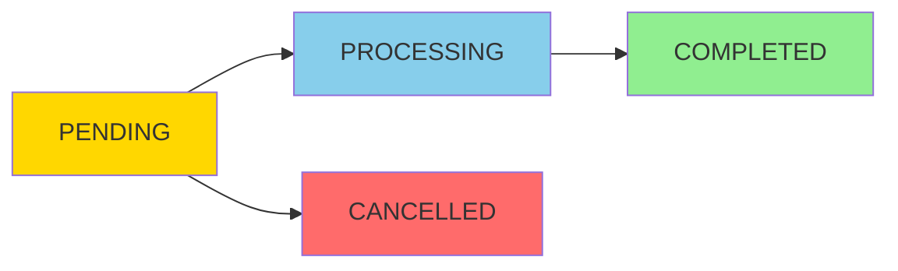

| Status | Ý nghĩa | Transition |
|--------|----------|-----------|
| **PENDING** | Vừa tạo, chưa có ShopOrder nào được confirm | → PROCESSING (khi ≥1 ShopOrder được confirm) |
| **PROCESSING** | Đang xử lý, ít nhất 1 ShopOrder đã confirm | → COMPLETED |
| **COMPLETED** | Tất cả ShopOrder đã DELIVERED hoặc CANCELLED | Terminal state |
| **CANCELLED** | Tất cả ShopOrder đều bị CANCELLED | Terminal state |

### 12.2 ShopOrder Status

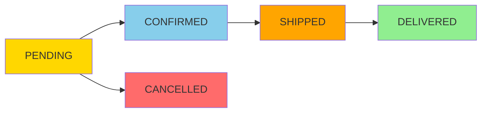

| Status | Ý nghĩa | Ai trigger | Next |
|--------|----------|-----------|------|
| **PENDING** | Mới tạo, chờ Seller xử lý | System (khi checkout) | → CONFIRMED hoặc → CANCELLED |
| **CONFIRMED** | Seller đã xác nhận, chuẩn bị đóng gói | Seller | → SHIPPED |
| **SHIPPED** | Đã giao cho vận chuyển | Seller | → DELIVERED |
| **DELIVERED** | Customer đã nhận hàng | Customer | Terminal state |
| **CANCELLED** | Bị hủy | Customer (khi PENDING) hoặc Seller (khi PENDING) | Terminal state |

### 12.3 Mối quan hệ giữa Order Status và ShopOrder Status

```
Order.status được DERIVE từ tổng hợp các ShopOrder.status:

- Tất cả ShopOrder = PENDING → Order = PENDING
- Ít nhất 1 ShopOrder ≠ PENDING và chưa tất cả complete → Order = PROCESSING
- Tất cả ShopOrder = DELIVERED hoặc CANCELLED → Order = COMPLETED
- Tất cả ShopOrder = CANCELLED → Order = CANCELLED
```

> **Ghi chú thiết kế:** Order.status có thể là computed field (tính từ ShopOrder) hoặc stored field (cập nhật khi ShopOrder thay đổi). Đề xuất: **stored field** + cập nhật khi ShopOrder status thay đổi — đơn giản hơn cho query.

---

## 13. Module Breakdown

### Module 01: Authentication

| Thuộc tính | Chi tiết |
|------------|---------|
| **Mục đích** | Xác thực và phân quyền người dùng |
| **Chức năng** | Register, Login, Logout, Session management, Role-based access control |
| **Role sử dụng** | Tất cả |
| **Phụ thuộc** | Không có (module nền tảng) |
| **Priority** | MUST — Week 1 |
| **MVP** | ✅ Có |

---

### Module 02: User Management

| Thuộc tính | Chi tiết |
|------------|---------|
| **Mục đích** | Quản lý thông tin người dùng, hồ sơ, địa chỉ |
| **Chức năng** | View/Edit Profile, Manage Addresses, Admin: view/search/lock/unlock users |
| **Role sử dụng** | Customer, Admin |
| **Phụ thuộc** | Authentication |
| **Priority** | MUST — Week 1-2 |
| **MVP** | ✅ Có |

---

### Module 03: Shop Management

| Thuộc tính | Chi tiết |
|------------|---------|
| **Mục đích** | Quản lý gian hàng: đăng ký, duyệt, profile |
| **Chức năng** | Register Shop, Approve/Reject Shop, Edit Shop, Suspend Shop, View Shop |
| **Role sử dụng** | Seller, Admin, Customer (xem) |
| **Phụ thuộc** | Authentication, User |
| **Priority** | MUST — Week 1-2 |
| **MVP** | ✅ Có |

---

### Module 04: Category Management

| Thuộc tính | Chi tiết |
|------------|---------|
| **Mục đích** | Quản lý danh mục sản phẩm toàn sàn (hierarchical) |
| **Chức năng** | CRUD categories (Admin), Browse by category (Customer), Select category (Seller) |
| **Role sử dụng** | Admin (CRUD), Seller (select), Customer (browse) |
| **Phụ thuộc** | Authentication |
| **Priority** | MUST — Week 1-2 |
| **MVP** | ✅ Có |

---

### Module 05: Product Catalog

| Thuộc tính | Chi tiết |
|------------|---------|
| **Mục đích** | CRUD sản phẩm, variants, images; browse, search, view detail |
| **Chức năng** | Create/Update/Delete Product, Upload Images, Manage Variants, Search, Filter, Sort, View Detail |
| **Role sử dụng** | Seller (CRUD), Customer (browse/search), Admin (review/hide) |
| **Phụ thuộc** | Shop, Category |
| **Priority** | MUST — Week 2 |
| **MVP** | ✅ Có |

---

### Module 06: Inventory

| Thuộc tính | Chi tiết |
|------------|---------|
| **Mục đích** | Quản lý tồn kho sản phẩm và biến thể |
| **Chức năng** | Set stock, Update stock, Check stock on add-to-cart/checkout, Deduct stock on order |
| **Role sử dụng** | Seller (manage), System (check/deduct) |
| **Phụ thuộc** | Product |
| **Priority** | SHOULD — Week 2-3 |
| **MVP** | ✅ Có (cơ bản) |

> **Ghi chú:** Inventory có thể gộp vào Product module nếu nhóm muốn đơn giản hóa. Stock chỉ là field trên Product/Variant.

---

### Module 07: Shopping Cart

| Thuộc tính | Chi tiết |
|------------|---------|
| **Mục đích** | Giỏ hàng đa Shop cho Customer |
| **Chức năng** | Add to cart, View cart (grouped by Shop), Update quantity, Remove item, Select items for checkout |
| **Role sử dụng** | Customer |
| **Phụ thuộc** | Product, Authentication |
| **Priority** | MUST — Week 2 |
| **MVP** | ✅ Có |

---

### Module 08: Order Management

| Thuộc tính | Chi tiết |
|------------|---------|
| **Mục đích** | Tạo, theo dõi, xử lý Order và ShopOrder |
| **Chức năng** | Checkout → Create Order/ShopOrder, View orders, Order detail, Confirm/Ship/Deliver, Cancel, Track status |
| **Role sử dụng** | Customer (tạo, xem, confirm received, cancel), Seller (confirm, ship), Admin (monitor) |
| **Phụ thuộc** | Cart, Product, Inventory, User (address), Payment, Shipping |
| **Priority** | MUST — Week 3 |
| **MVP** | ✅ Có |

---

### Module 09: Payment (Mock)

| Thuộc tính | Chi tiết |
|------------|---------|
| **Mục đích** | Xử lý thanh toán (mock, không tích hợp gateway thật) |
| **Chức năng** | Select payment method (COD/mock online), Process payment (simulate), Payment status tracking |
| **Role sử dụng** | Customer, System |
| **Phụ thuộc** | Order |
| **Priority** | MUST — Week 3 |
| **MVP** | ✅ Có (mock) |

> **Ghi chú:** Payment có thể gộp vào Order module vì MVP chỉ mock. Tách riêng nếu muốn mở rộng sau.

---

### Module 10: Shipping (Mock)

| Thuộc tính | Chi tiết |
|------------|---------|
| **Mục đích** | Quản lý giao hàng (mock, Seller cập nhật thủ công) |
| **Chức năng** | Shipping method selection (flat rate), Seller mark as shipped, Customer track, Confirm received |
| **Role sử dụng** | Customer, Seller, System |
| **Phụ thuộc** | Order |
| **Priority** | MUST — Week 3 |
| **MVP** | ✅ Có (mock) |

---

### Module 11: Review & Rating

| Thuộc tính | Chi tiết |
|------------|---------|
| **Mục đích** | Đánh giá sản phẩm, tạo niềm tin |
| **Chức năng** | Submit review (rating + comment + images), View reviews on product page, Average rating calculation |
| **Role sử dụng** | Customer (write), Customer/Guest (read) |
| **Phụ thuộc** | Order (phải DELIVERED mới review được), Product |
| **Priority** | SHOULD — Week 4 |
| **MVP** | ✅ Có (nếu kịp) |

---

### Module 12: Voucher

| Thuộc tính | Chi tiết |
|------------|---------|
| **Mục đích** | Mã giảm giá của Shop |
| **Chức năng** | Seller create voucher (code, discount amount/%, min order, expiry), Customer apply at checkout |
| **Role sử dụng** | Seller (create), Customer (apply) |
| **Phụ thuộc** | Order, Shop |
| **Priority** | COULD — Week 4 |
| **MVP** | ⚠️ Optional |

---

### Module 13: Wishlist

| Thuộc tính | Chi tiết |
|------------|---------|
| **Mục đích** | Lưu sản phẩm yêu thích |
| **Chức năng** | Add/Remove product, View wishlist |
| **Role sử dụng** | Customer |
| **Phụ thuộc** | Product, Authentication |
| **Priority** | COULD — Week 4 |
| **MVP** | ⚠️ Optional |

---

### Module 14: Complaint

| Thuộc tính | Chi tiết |
|------------|---------|
| **Mục đích** | Giải quyết tranh chấp giữa Customer và Seller |
| **Chức năng** | Submit complaint, View complaints, Admin process/resolve |
| **Role sử dụng** | Customer (submit), Admin (manage) |
| **Phụ thuộc** | Order, User |
| **Priority** | SHOULD — Week 4 |
| **MVP** | ✅ Có (cơ bản) |

---

### Module 15: Admin Panel

| Thuộc tính | Chi tiết |
|------------|---------|
| **Mục đích** | Giao diện quản trị toàn hệ thống |
| **Chức năng** | Tổng hợp: User mgmt, Shop mgmt, Category mgmt, Product mgmt, Order monitor, Complaint mgmt, Dashboard |
| **Role sử dụng** | Admin |
| **Phụ thuộc** | Tất cả module khác |
| **Priority** | MUST — Xây dần qua các tuần |
| **MVP** | ✅ Có |

---

### Module 16: Dashboard & Statistics

| Thuộc tính | Chi tiết |
|------------|---------|
| **Mục đích** | Thống kê tổng quan cho Seller và Admin |
| **Chức năng** | Seller: revenue, order count, product count. Admin: users, shops, products, orders, revenue |
| **Role sử dụng** | Seller, Admin |
| **Phụ thuộc** | Order, Product, User, Shop |
| **Priority** | SHOULD — Week 4 |
| **MVP** | ✅ Có (cơ bản) |

---

## 14. Module Dependency Map

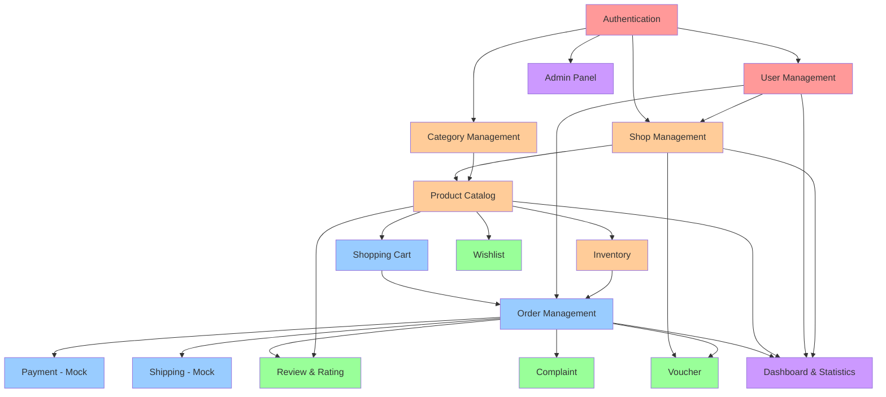

**Legend:**
- 🔴 Red: Foundation (Week 1-2)
- 🟠 Orange: Core Marketplace (Week 2)
- 🔵 Blue: Commerce Flow (Week 3)
- 🟢 Green: Engagement & Support (Week 4)
- 🟣 Purple: Admin & Analytics (Xây dần)

### Parallel Development Opportunities

| Module Group | Có thể phát triển song song | Điều kiện |
|-------------|---------------------------|-----------|
| User + Shop + Category | ✅ Song song sau khi Auth xong | Chỉ cần Auth module |
| Product + Cart | ✅ Cart phát triển song song Product | Cart mock data ban đầu |
| Review + Complaint + Wishlist | ✅ Hoàn toàn song song | Chỉ cần Order + Product |
| Admin Panel | ✅ Xây dần theo từng module | CRUD cho từng entity |
| Dashboard | ❌ Cần nhiều module hoàn thành | Query aggregate data |

---

## 15. MVP Definition

### MVP MUST HAVE (Không thể thiếu)

| # | Tính năng | Lý do |
|---|-----------|-------|
| 1 | Customer Register/Login/Logout | Nền tảng cho mọi thứ |
| 2 | Customer Profile & Address | Cần cho checkout |
| 3 | Admin Category CRUD | Cấu trúc sản phẩm |
| 4 | Seller Register Shop + Admin Approve | Bản chất multi-vendor |
| 5 | Seller CRUD Product (basic) | Không sản phẩm = không sàn |
| 6 | Customer Browse/Search Products | Phải tìm được hàng |
| 7 | Customer Add to Cart | Bước trước checkout |
| 8 | Multi-Shop Checkout → Order + ShopOrder | Nghiệp vụ trung tâm |
| 9 | Customer View/Track Orders | Theo dõi đơn |
| 10 | Seller View/Process ShopOrder | Seller phải xử lý đơn |
| 11 | Customer Confirm Received | Hoàn thành flow |
| 12 | Admin User/Shop Management (basic) | Quản trị cơ bản |
| 13 | Role-based Access Control | Bảo mật cơ bản |

### MVP SHOULD HAVE (Rất quan trọng, cố gắng hoàn thành)

| # | Tính năng | Lý do |
|---|-----------|-------|
| 1 | Product Variants (size/color) | Sản phẩm thực tế |
| 2 | Product Images | UX cơ bản |
| 3 | Stock Management (basic) | Tránh oversell |
| 4 | Rating & Review | Engagement, demo tốt |
| 5 | Complaint (basic) | Trust, quản trị |
| 6 | Admin Product Management | Chất lượng catalog |
| 7 | Seller Basic Dashboard | Seller insight |
| 8 | Admin Basic Dashboard | Platform overview |

### POST-MVP (Không làm trong 1 tháng)

| # | Tính năng | Lý do loại |
|---|-----------|-----------|
| 1 | Voucher | Nice-to-have, không ảnh hưởng core flow |
| 2 | Wishlist | Nice-to-have |
| 3 | Advanced Filter/Sort | UX enhancement |
| 4 | Order Cancel (with conditions) | Logic phức tạp |
| 5 | Review Images | Enhancement |
| 6 | Chat | Quá phức tạp |
| 7 | Real Payment | Ngoài scope |
| 8 | Real Shipping API | Ngoài scope |
| 9 | Notification System | Cần infrastructure |
| 10 | Social Login | Nice-to-have |

### MVP Demo Scenario

Khi demo, hệ thống phải chạy được kịch bản sau end-to-end:

```
1. Admin đăng nhập → Tạo categories
2. User A đăng ký → Đăng ký Shop "Electronics Plus" → Admin approve
3. User B đăng ký → Đăng ký Shop "Fashion World" → Admin approve
4. Seller A tạo 3 sản phẩm (laptop, phone, earbuds)
5. Seller B tạo 3 sản phẩm (shirt, dress, shoes)
6. Customer C đăng ký → Đăng nhập
7. Customer C tìm kiếm "phone" → Thấy sản phẩm Seller A
8. Customer C browse category "Fashion" → Thấy sản phẩm Seller B
9. Customer C add to cart: phone (Shop A) + shirt (Shop B)
10. Customer C checkout → Hệ thống tạo Order + 2 ShopOrder
11. Seller A confirm ShopOrder → Mark shipped
12. Seller B confirm ShopOrder → Mark shipped
13. Customer C confirm received (Shop A) → Review phone ⭐⭐⭐⭐⭐
14. Customer C confirm received (Shop B) → Order COMPLETED
15. Admin xem dashboard → Thấy statistics
```

---

## 16. 1-Month Roadmap

### WEEK 1: Foundation & Planning

| Thuộc tính | Chi tiết |
|------------|---------|
| **Goal** | Hoàn thành planning, thiết kế database, setup project |
| **Features** | Authentication (Register, Login, Logout), User Profile, Address Management, Shop Registration, Admin approve Shop, Category CRUD |
| **Deliverables** | Planning docs hoàn chỉnh, ERD v1, Database schema, Spring Boot project setup, Authentication module working, Admin category CRUD working |
| **Dependencies** | Không có (tuần đầu tiên) |
| **Definition of Done** | Register/Login/Logout hoạt động, Admin có thể CRUD category, Seller có thể submit Shop registration, Admin có thể approve/reject |
| **Rủi ro** | Database design thay đổi nhiều nếu chưa phân tích kỹ; Spring Security config phức tạp cho người mới |

---

### WEEK 2: Core Marketplace

| Thuộc tính | Chi tiết |
|------------|---------|
| **Goal** | Seller có thể tạo sản phẩm, Customer có thể browse/search và thêm giỏ hàng |
| **Features** | Product CRUD (Seller), Product Images, Product Variants, Stock, Browse Products, Search Products, View Product Detail, Shopping Cart, View Shop Page, Admin User Management |
| **Deliverables** | Product module hoàn chỉnh, Shopping Cart hoạt động, Homepage với sản phẩm, Search hoạt động |
| **Dependencies** | Authentication + Category từ Week 1 |
| **Definition of Done** | Seller tạo được sản phẩm có variants và images, Customer browse/search tìm thấy sản phẩm, Customer add to cart thành công, Cart hiển thị grouped by Shop |
| **Rủi ro** | Product variant logic phức tạp; Image upload cần xử lý kỹ; Cart phải handle multi-shop |

---

### WEEK 3: Commerce Flow

| Thuộc tính | Chi tiết |
|------------|---------|
| **Goal** | Checkout end-to-end hoạt động, Seller xử lý được ShopOrder |
| **Features** | Checkout Page, Multi-Shop Order Creation, Payment (mock), Shipping (mock), Order Tracking, Seller Order Processing, Customer Confirm Received, Admin Product/Order Management |
| **Deliverables** | Checkout → Order → ShopOrder flow hoạt động, Seller xử lý ShopOrder, Customer theo dõi order |
| **Dependencies** | Cart + Product + User Address từ Week 2 |
| **Definition of Done** | Customer checkout → Order + N ShopOrder tạo thành công, Seller confirm → ship → Customer confirm received flow hoạt động, Stock giảm khi checkout, Transaction integrity đảm bảo |
| **Rủi ro** | Multi-shop checkout là logic phức tạp nhất; Transaction management có thể gặp vấn đề; Nhiều edge case |

---

### WEEK 4: Integration, Polish & Demo

| Thuộc tính | Chi tiết |
|------------|---------|
| **Goal** | Hoàn thiện SHOULD HAVE features, integration test, fix bugs, chuẩn bị demo |
| **Features** | Review & Rating, Complaint, Seller Dashboard, Admin Dashboard, Filter/Sort (if time), Bug fixes, UI polish |
| **Deliverables** | Review hoạt động, Complaint hoạt động, Dashboard cơ bản, Full demo scenario chạy OK, Tài liệu hoàn chỉnh |
| **Dependencies** | Tất cả từ Week 1-3 |
| **Definition of Done** | Full MVP demo scenario chạy end-to-end, Không có blocker bug, All MUST HAVE features hoạt động, Documentation cập nhật |
| **Rủi ro** | Không đủ thời gian fix bugs; Integration issues; UI chưa polish; Tài liệu chưa kịp |

---

### Roadmap Timeline Visual

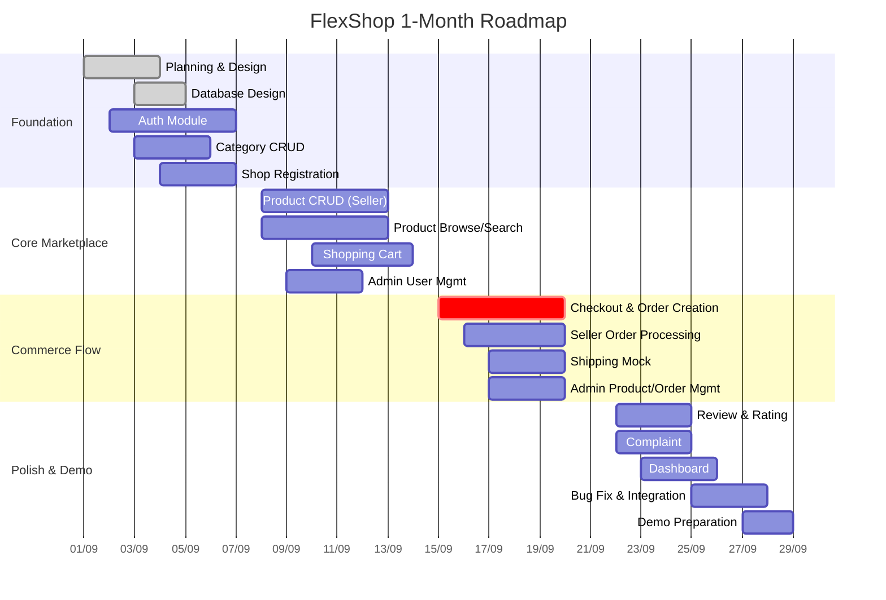

---

## 17. Detailed Week 1 Plan

### DAY 1 (Monday): Requirements & Vision

**Mục tiêu:** Toàn nhóm thống nhất về sản phẩm.

| Task | Người thực hiện | Output |
|------|----------------|--------|
| Review tài liệu planning này | Toàn nhóm | Mọi người hiểu scope |
| Thống nhất Product Vision | Toàn nhóm | Vision statement final |
| Xác nhận 3 roles: Customer, Seller, Admin | Toàn nhóm | Role matrix |
| Quyết định các `[DECISION REQUIRED]` | Toàn nhóm | Decision log |
| Xác nhận MoSCoW prioritization | Toàn nhóm | Approved backlog |

**Deliverable:** Product Vision Document (final), Decision Log.

---

### DAY 2 (Tuesday): Product Backlog & User Stories

**Mục tiêu:** Backlog hoàn chỉnh, User Stories rõ ràng.

| Task | Người thực hiện | Output |
|------|----------------|--------|
| Review & finalize Epic list | PM / Team Lead | Epic list (final) |
| Viết Acceptance Criteria chi tiết cho MUST stories | Toàn nhóm (chia theo module) | AC document |
| Estimate Story Points (Planning Poker) | Toàn nhóm | Estimated backlog |
| Assign stories to Sprints | PM / Scrum Master | Sprint plan |

**Deliverable:** Product Backlog (final), Sprint Plan.

---

### DAY 3 (Wednesday): Business Flow & Multi-Vendor Logic

**Mục tiêu:** Mọi người hiểu sâu multi-vendor flow.

| Task | Người thực hiện | Output |
|------|----------------|--------|
| Walk through all 14 User Flows | Toàn nhóm | Flow diagrams (final) |
| Deep dive: Multi-shop checkout flow | Toàn nhóm | Checkout spec |
| Deep dive: Order / ShopOrder lifecycle | Toàn nhóm | State machine diagram |
| Identify edge cases & business rules | Toàn nhóm | Business rules document |

**Deliverable:** User Flow Document (final), Business Rules Document.

---

### DAY 4 (Thursday): Module Design & Architecture

**Mục tiêu:** Kiến trúc hệ thống ở mức concept.

| Task | Người thực hiện | Output |
|------|----------------|--------|
| Module decomposition (final) | Architect / Team Lead | Module list |
| Dependency mapping | Architect | Dependency diagram |
| Package structure proposal | Architect | Package tree |
| URL routing plan (page URLs) | Architect + Frontend devs | URL map |
| Xác định convention: naming, coding standards | Architect | Development guide |

**Deliverable:** Architecture Document (concept-level), Development Guide.

---

### DAY 5 (Friday): Database Planning

**Mục tiêu:** Xác định entities và relationships (chưa viết SQL).

| Task | Người thực hiện | Output |
|------|----------------|--------|
| List entity candidates | Toàn nhóm | Entity list |
| Define attributes per entity | Chia theo module | Entity specification |
| Define relationships (1:N, N:N, etc.) | Architect + nhóm | Relationship map |
| Draft ERD v1 (diagram only, no SQL) | Architect | ERD v1 diagram |
| Identify: soft delete, audit fields, enums | Architect | Data conventions |

**Entity candidates dự kiến:**
- User, Role, UserRole
- Address
- Shop
- Category
- Product, ProductImage, ProductVariant
- Cart, CartItem
- Order, ShopOrder, OrderItem
- Payment
- Review, ReviewImage
- Voucher
- Complaint
- Dashboard (aggregate views, không cần entity)

**Deliverable:** ERD v1, Entity Specification.

---

### DAY 6 (Saturday): Team Allocation & Git Workflow

**Mục tiêu:** Mỗi người biết mình làm gì, quy trình Git rõ ràng.

| Task | Người thực hiện | Output |
|------|----------------|--------|
| Assign modules to members | PM / Team Lead | Team allocation matrix |
| Setup Git repository | Team Lead | Repo ready |
| Define branching strategy | Team Lead | Git workflow doc |
| Define commit message convention | Team Lead | Convention doc |
| Define code review process | Team Lead | Review checklist |
| Setup Spring Boot project skeleton | Architect | Base project |
| Setup database connection | Architect | Config working |

**Git Workflow đề xuất:**

```
main (production-ready)
  └── develop (integration)
        ├── feature/auth-register
        ├── feature/auth-login
        ├── feature/shop-registration
        ├── feature/product-crud
        └── ...
```

**Branch Rules:**
- Tạo branch từ `develop`
- Naming: `feature/<module>-<feature>`, `bugfix/<description>`
- PR review bởi ít nhất 1 người khác
- Merge vào `develop` khi review pass
- Merge `develop` → `main` khi sprint kết thúc

**Deliverable:** Team Allocation, Git Workflow, Base Project.

---

### DAY 7 (Sunday): Review & Requirement Freeze

**Mục tiêu:** Đóng băng yêu cầu, chuẩn bị cho Week 2.

| Task | Người thực hiện | Output |
|------|----------------|--------|
| Review toàn bộ tài liệu Week 1 | Toàn nhóm | Review notes |
| Fix gaps, unclear requirements | Toàn nhóm | Updated docs |
| **Requirement Freeze** | PM | Frozen scope |
| Sprint 1 review & Sprint 2 planning | Scrum Master | Sprint 2 plan |
| Confirm: ERD, Architecture, Team assignment | Toàn nhóm | Final confirmation |
| Start coding Authentication (nếu base project ready) | Member 2 | Auth foundation |

**Deliverable:** All Week 1 documents finalized, Requirement frozen, Sprint 2 ready.

---

## 18. 7-Member Team Allocation

### Đề xuất phân công

| Member | Role | Modules chịu trách nhiệm | Lý do |
|--------|------|--------------------------|-------|
| **Member 1** | **Tech Lead / Architect** | Project setup, Architecture, Database design, Cross-module integration, Code review | Người có kinh nghiệm nhất. Thiết kế nền tảng, hỗ trợ kỹ thuật cho toàn nhóm, giải quyết conflicts |
| **Member 2** | **Auth & User Developer** | Authentication, User Management, Address, Spring Security, Role-based Access | Auth là nền tảng, phải vững. Xong sớm để mở khóa cho các module khác |
| **Member 3** | **Shop & Category Developer** | Shop Management, Category Management, Shop Approval flow | Shop + Category là dependency của Product. Phải xong Week 1-2 |
| **Member 4** | **Product Developer** | Product CRUD, Product Variants, Product Images, Inventory, Search | Module lớn nhất về data. Cần một người tập trung full-time |
| **Member 5** | **Cart & Order Developer** | Shopping Cart, Checkout, Order/ShopOrder creation, Multi-shop logic | Module phức tạp nhất về business logic. Cần người mạnh về logic |
| **Member 6** | **Order Processing & Payment** | Seller Order Processing, Shipping (mock), Payment (mock), Order Tracking | Bổ sung cho Member 5. Xử lý phía Seller và post-checkout flow |
| **Member 7** | **Admin & Engagement Developer** | Admin Panel (all), Dashboard, Review & Rating, Complaint, Wishlist | Admin panel tổng hợp CRUD từ nhiều module, Dashboard aggregation |

### Nguyên tắc phân công

1. **Mỗi module có 1 người chịu trách nhiệm chính** — tránh ai cũng động ai cũng bỏ.
2. **Module liên quan nhóm gần nhau** — Cart+Order, Shop+Category — để giảm dependency conflict.
3. **Member 1 (Tech Lead) không nhận module cụ thể** — tập trung review, hỗ trợ, integration. Nếu rảnh có thể code supporting utilities.
4. **Member 5 + 6 phối hợp chặt** — Cart→Checkout→Order là flow liền, cần sync hàng ngày.
5. **Member 7 bắt đầu muộn hơn** — Admin/Dashboard cần các module khác có data. Week 1-2 có thể hỗ trợ Member 2 hoặc 3, hoặc tập trung UI templates.

### Timeline theo thành viên

| Member | Week 1 | Week 2 | Week 3 | Week 4 |
|--------|--------|--------|--------|--------|
| M1 | DB design, Project setup | Code review, Integration | Checkout review, Performance | Final integration, Demo prep |
| M2 | Auth Register/Login | User Profile, Address | Hỗ trợ M5 (checkout cần User) | Bug fix, Security review |
| M3 | Shop Registration, Category CRUD | Shop Approval, View Shop | Admin Shop Management | Hỗ trợ M7 (Admin panel) |
| M4 | — | Product CRUD, Variants, Images | Search, Filter | Bug fix, Data seeding |
| M5 | — | Shopping Cart | Checkout, Order Creation | Bug fix, Edge cases |
| M6 | — | — | Seller Order Processing, Shipping | Payment mock, Order tracking |
| M7 | UI Base templates | Admin User Mgmt | Admin Product/Order | Dashboard, Review, Complaint |

---

## 19. Definition of Done

### User Story DoD

Một User Story được xem là **DONE** khi:

- [ ] Code hoàn thành và build thành công (không compile error)
- [ ] Business logic hoạt động đúng theo Acceptance Criteria
- [ ] Input validation hoạt động (cả client-side và server-side)
- [ ] Error handling: hiển thị lỗi rõ ràng cho user
- [ ] UI hiển thị đúng, không bị vỡ layout
- [ ] Đã test thủ công (happy path + 1-2 edge cases)
- [ ] Không có bug blocker
- [ ] Code đã được push lên feature branch
- [ ] Pull Request đã được tạo và review bởi ít nhất 1 thành viên khác
- [ ] PR đã được merge vào `develop`

### Feature DoD

Một Feature được xem là **DONE** khi:

- [ ] Tất cả User Stories trong Feature đã DONE
- [ ] Feature hoạt động end-to-end
- [ ] Integration với các module phụ thuộc hoạt động
- [ ] Không có regression từ các feature khác

### Module DoD

Một Module được xem là **DONE** khi:

- [ ] Tất cả Features trong Module (theo sprint scope) đã DONE
- [ ] Module hoạt động ổn định
- [ ] Role-based access control hoạt động đúng
- [ ] Data persistence hoạt động (CRUD, database)
- [ ] Documentation cập nhật (nếu cần)

### Sprint DoD

Một Sprint được xem là **DONE** khi:

- [ ] Tất cả MUST stories trong Sprint đã DONE
- [ ] ≥ 80% SHOULD stories đã DONE
- [ ] `develop` branch build và chạy thành công
- [ ] Demo cho nhóm thành công
- [ ] Sprint retrospective hoàn thành
- [ ] Sprint tiếp theo đã được plan

### MVP DoD

MVP được xem là **DONE** khi:

- [ ] Full demo scenario (Section 15) chạy end-to-end
- [ ] Tất cả MUST HAVE features hoạt động
- [ ] ≥ 70% SHOULD HAVE features hoạt động
- [ ] Không có bug blocker hoặc critical
- [ ] 3 roles (Customer, Seller, Admin) hoạt động đúng phân quyền
- [ ] Multi-shop checkout hoạt động
- [ ] Data integrity đảm bảo (không mất data, không duplicate)
- [ ] Tài liệu cơ bản hoàn chỉnh
- [ ] Có thể demo cho giảng viên

---

## 20. AI Development Strategy

### Nguyên tắc sử dụng AI

| AI ĐƯỢC dùng để | AI KHÔNG ĐƯỢC tự ý |
|----------------|--------------------|
| Phân tích yêu cầu, brainstorm | Thay đổi requirements đã freeze |
| Viết documentation, planning | Thay đổi database architecture |
| Sinh boilerplate code | Thay đổi tech stack |
| Hỗ trợ implement từ spec | Thêm feature ngoài scope |
| Debug và fix errors | Xóa business rule |
| Viết test cases | Tự ý refactor architecture |
| Review code | Override developer decisions |
| Generate SQL từ ERD | Tạo dependency mới không approve |
| Generate Thymeleaf templates từ wireframe | — |

### Quy trình sử dụng AI

```mermaid
flowchart LR
    A[Requirement / Spec] --> B[Human Review & Approve]
    B --> C[Craft AI Prompt]
    C --> D[AI generates output]
    D --> E[Developer Review]
    E --> F{Output OK?}
    F -->|Không| G[Chỉnh prompt hoặc manual fix]
    G --> C
    F -->|Có| H[Test]
    H --> I{Test pass?}
    I -->|Không| J[Debug - có thể dùng AI]
    J --> E
    I -->|Có| K[PR & Code Review]
    K --> L[Merge]
```

### Best Practices khi dùng AI

1. **Cung cấp context đầy đủ:** Khi prompt AI, include Entity class, DTO, existing code để AI sinh code consistent.
2. **Một prompt = một task nhỏ:** Đừng yêu cầu AI code cả module trong 1 prompt.
3. **Luôn review output:** AI có thể sinh code chạy được nhưng sai business logic.
4. **Giữ convention:** Nếu AI sinh code khác convention nhóm → chỉnh lại.
5. **Version control trước khi apply AI code:** Commit trước, apply AI code sau → dễ revert nếu lỗi.
6. **Không dùng AI thay code review:** AI review bổ sung, nhưng human review vẫn bắt buộc.

### Cảnh báo khi dùng AI

> [!WARNING]
> **7 người dùng AI cùng lúc có thể tạo code không nhất quán.** Để tránh:
> - Thiết lập coding convention rõ ràng TRƯỚC khi code
> - Chia sẻ prompt templates chung
> - Member 1 (Tech Lead) review tất cả PR để đảm bảo consistency
> - Dùng chung base classes, utility methods thay vì để AI tạo riêng

---

## 21. Documentation Plan

### Tài liệu bắt buộc (MUST HAVE)

| # | Tài liệu | Mô tả | Ai viết | Khi nào |
|---|----------|-------|---------|---------|
| 1 | Product Vision | Mục tiêu, scope, roles | Team Lead | Week 1 Day 1 |
| 2 | Product Backlog | Epics, User Stories, Priority, SP | PM / Team | Week 1 Day 2 |
| 3 | Business Rules | Multi-vendor logic, Order lifecycle, validation rules | Team | Week 1 Day 3 |
| 4 | ERD | Entity Relationship Diagram | Architect | Week 1 Day 5 |
| 5 | Database Specification | Tables, columns, types, constraints | Architect | Week 1 Day 5 |
| 6 | Git Workflow | Branching, commit, PR rules | Team Lead | Week 1 Day 6 |
| 7 | Development Guide | Convention, naming, coding standards | Architect | Week 1 Day 6 |

### Tài liệu nên có (SHOULD HAVE)

| # | Tài liệu | Mô tả | Ai viết | Khi nào |
|---|----------|-------|---------|---------|
| 8 | User Flows | Diagrams cho các flow chính | BA / Team | Week 1 Day 3 |
| 9 | System Architecture | Package structure, layer diagram | Architect | Week 1 Day 4 |
| 10 | URL / Page Map | Danh sách các page URLs | Frontend lead | Week 1 Day 4 |
| 11 | Test Plan | Test scenarios cho MVP demo | QA / Team | Week 3 |
| 12 | API Specification | Internal endpoints (nếu dùng AJAX) | Backend devs | Week 2 |

### Tài liệu tùy chọn (OPTIONAL)

| # | Tài liệu | Mô tả | Khi nào |
|---|----------|-------|---------|
| 13 | UI Wireframes | Sketch các trang chính | Week 1 nếu có thời gian |
| 14 | Deployment Guide | Cách deploy cho demo | Week 4 |
| 15 | Use Case Diagrams | UML Use Case | Nếu giảng viên yêu cầu |

---

## 22. Risk Management

### Risk Matrix

| # | Risk | Probability | Impact | Mitigation |
|---|------|-------------|--------|------------|
| R1 | **Scope quá lớn** — cố nhồi quá nhiều feature | Cao | Cao | MoSCoW prioritization nghiêm ngặt. Requirement freeze sau Week 1. MUST-only nếu trễ |
| R2 | **7 người code không đồng bộ** — code style khác nhau, logic conflict | Cao | Cao | Coding convention document, PR review bắt buộc, Tech Lead review tất cả |
| R3 | **Database thay đổi liên tục** — schema phải sửa nhiều lần | Trung bình | Cao | ERD freeze sau Day 5. Thay đổi nhỏ qua Migration. Thay đổi lớn cần nhóm approve |
| R4 | **AI tạo code không nhất quán** — mỗi người prompt khác nhau | Cao | Trung bình | Chia sẻ prompt templates, base code trước. Review kỹ AI output |
| R5 | **Merge conflict** — nhiều người sửa cùng file | Trung bình | Trung bình | Feature branch strategy, merge thường xuyên, chia module rõ ràng |
| R6 | **Không đủ thời gian integration** — module chạy riêng OK, ghép lại lỗi | Cao | Cao | Integration test từ Week 3. Merge vào develop daily. Dành 2-3 ngày cuối cho integration |
| R7 | **Authentication/Security lỗi** — Spring Security config sai | Trung bình | Cao | Member 2 tập trung Auth. Tech Lead review. Test role-based access sớm |
| R8 | **Multi-shop Order phức tạp** — checkout flow có nhiều edge case | Cao | Cao | Thiết kế kỹ trước code. Member 5 + 6 phối hợp chặt. Giữ đơn giản: mock payment/shipping |
| R9 | **Thymeleaf UI mất nhiều thời gian** — server-side rendering chậm develop | Trung bình | Trung bình | Dùng Bootstrap cho UI nhanh. Tạo layout template chung. Không chạy theo UI đẹp, ưu tiên chức năng |
| R10 | **Dependency blocking** — Member A chờ Module của Member B | Trung bình | Cao | Dependency map rõ ràng. Mock/stub interface khi module phụ thuộc chưa xong. Song song hóa tối đa |
| R11 | **Thành viên absent/bận** — 1 người bị kẹt → module trễ | Thấp | Cao | Mỗi module có buddy (người backup biết context). Document đầy đủ để người khác tiếp |
| R12 | **Demo day lỗi** — hệ thống chạy local OK nhưng demo lỗi | Thấp | Rất cao | Rehearse demo 2 lần trước ngày D. Chuẩn bị sample data. Có backup plan (video recorded) |

### Risk Response Strategy

```
Mỗi khi gặp risk:
1. Phát hiện sớm (daily standup)
2. Escalate lên Team Lead
3. Quyết định: Fix / Workaround / Descope
4. Nếu descope → chuyển feature từ MUST → POST-MVP (cần nhóm đồng ý)
```

---

## 23. System Acceptance Criteria

### Customer Acceptance

| # | Criteria | Test Method |
|---|---------|-------------|
| AC-C01 | Customer đăng ký account mới thành công | Register với email/password/name/phone → Login thành công |
| AC-C02 | Customer đăng nhập thành công | Login → Redirect homepage → Thấy tên user |
| AC-C03 | Customer xem được danh sách sản phẩm trên homepage | Homepage hiển thị ≥ 1 sản phẩm |
| AC-C04 | Customer tìm kiếm sản phẩm bằng keyword | Search "phone" → Thấy sản phẩm có "phone" trong tên |
| AC-C05 | Customer xem được chi tiết sản phẩm | Click sản phẩm → Thấy name, description, price, images, reviews |
| AC-C06 | Customer thêm sản phẩm vào giỏ | Click "Add to Cart" → Cart count tăng |
| AC-C07 | Customer chỉnh sửa giỏ hàng | Thay đổi quantity, xóa item → Cart cập nhật |
| AC-C08 | Customer checkout từ 1 Shop | Checkout items từ 1 Shop → Order + 1 ShopOrder tạo thành công |
| AC-C09 | Customer checkout từ nhiều Shop | Checkout items từ 2+ Shop → Order + N ShopOrder tạo thành công |
| AC-C10 | Customer xem danh sách đơn hàng | Order list hiển thị orders với status |
| AC-C11 | Customer xem chi tiết đơn hàng | Order detail hiển thị ShopOrder breakdown |
| AC-C12 | Customer theo dõi trạng thái ShopOrder | Status cập nhật khi Seller confirm/ship |
| AC-C13 | Customer xác nhận nhận hàng | Click "Confirm Received" → ShopOrder = DELIVERED |
| AC-C14 | Customer viết review sau khi nhận hàng | Submit review (1-5 stars + comment) → Hiển thị trên product page |
| AC-C15 | Customer quản lý địa chỉ | Thêm/sửa/xóa địa chỉ giao hàng |

### Seller Acceptance

| # | Criteria | Test Method |
|---|---------|-------------|
| AC-S01 | User đăng ký Shop thành công | Submit Shop registration → Status PENDING |
| AC-S02 | Seller tạo sản phẩm sau khi Shop được duyệt | Shop ACTIVE → Create product → Product xuất hiện trên sàn |
| AC-S03 | Seller tạo sản phẩm có biến thể | Tạo product với 2+ variants → Mỗi variant có price và stock riêng |
| AC-S04 | Seller sửa/xóa sản phẩm | Update product info → Thay đổi reflect. Delete → Product không còn hiển thị |
| AC-S05 | Seller quản lý tồn kho | Cập nhật stock → Stock reflect đúng |
| AC-S06 | Seller xem danh sách ShopOrder | ShopOrder list hiển thị orders gửi tới Shop mình |
| AC-S07 | Seller confirm ShopOrder | Click Confirm → Status PENDING → CONFIRMED |
| AC-S08 | Seller đánh dấu đã giao hàng | Click Ship → Status CONFIRMED → SHIPPED |
| AC-S09 | Seller xem doanh thu cơ bản | Dashboard hiển thị: revenue, order count, product count |

### Admin Acceptance

| # | Criteria | Test Method |
|---|---------|-------------|
| AC-A01 | Admin xem danh sách users | User list hiển thị với search |
| AC-A02 | Admin lock/unlock user | Lock user → User không login được. Unlock → Login lại được |
| AC-A03 | Admin duyệt Shop | Approve Shop → Status ACTIVE. Seller có thể tạo product |
| AC-A04 | Admin từ chối Shop | Reject Shop (with reason) → Status REJECTED |
| AC-A05 | Admin CRUD categories | Create/Update/Delete category → Reflect trên toàn hệ thống |
| AC-A06 | Admin quản lý products | Ẩn/Xóa product vi phạm → Product không hiển thị cho Customer |
| AC-A07 | Admin giám sát orders | Order list hiển thị tất cả orders hệ thống |
| AC-A08 | Admin xử lý complaint | Xem complaint → Process → Resolve/Reject |
| AC-A09 | Admin xem dashboard | Dashboard hiển thị: total users, shops, products, orders, revenue |

### System-wide Acceptance

| # | Criteria | Test Method |
|---|---------|-------------|
| AC-SYS01 | Role-based access control | Customer không thể access Seller Center / Admin Panel |
| AC-SYS02 | Data isolation | Seller A không thấy data của Seller B |
| AC-SYS03 | Transaction integrity | Checkout fail → không tạo order nào, stock không giảm |
| AC-SYS04 | Stock management | Checkout → stock giảm. Cancel → stock hoàn |
| AC-SYS05 | Full demo scenario | Section 15 demo scenario chạy end-to-end |

### Acceptance Criteria bổ sung (thiếu từ danh sách gốc)

| # | Criteria | Giải thích |
|---|---------|-----------|
| AC-C16 | Customer browse sản phẩm theo category | Click category → Thấy sản phẩm thuộc category đó |
| AC-C17 | Customer xem Shop page | Click shop name → Thấy shop info + product listing |
| AC-S10 | Seller quản lý thông tin Shop | Sửa tên, mô tả, logo → Cập nhật |
| AC-A10 | Admin tạm ngưng Shop | Suspend → Sản phẩm Shop không hiển thị, Seller không thể tạo product mới |
| AC-SYS06 | Password được hash | Kiểm tra database: password không lưu plain text |
| AC-SYS07 | Server-side validation | Submit form invalid → Server reject + hiển thị lỗi |

---

## 24. Recommended Next Steps

### Hành động ngay sau khi đọc tài liệu này

| Bước | Hành động | Ai | Thời gian |
|------|----------|-----|-----------|
| 1 | **Họp nhóm đọc tài liệu** | Toàn nhóm (7 người) | 2-3 giờ |
| 2 | **Quyết định các `[DECISION REQUIRED]`** | Toàn nhóm | 30 phút |
| 3 | **Xác nhận MoSCoW** — đồng ý/thay đổi ưu tiên | Toàn nhóm | 30 phút |
| 4 | **Xác nhận Team Allocation** — mỗi người nhận module | PM / Team Lead | 30 phút |
| 5 | **Bắt đầu thiết kế Database (ERD v1)** | Architect (Member 1) | 1-2 ngày |
| 6 | **Setup Spring Boot project skeleton** | Architect (Member 1) | 0.5 ngày |
| 7 | **Setup Git repository + branching** | Team Lead | 0.5 ngày |
| 8 | **Bắt đầu code Authentication module** | Member 2 | Week 1 |

### Danh sách `[DECISION REQUIRED]` cần giải quyết

| # | Quyết định | Options | Recommendation |
|---|-----------|---------|----------------|
| D1 | Customer review có được edit không? | A: Không cho edit (đơn giản). B: Cho edit 1 lần trong 24h | A — Đơn giản cho MVP |
| D2 | Admin có thể mua hàng (Customer role) không? | A: Admin account riêng. B: Admin cũng là Customer | A — Tách biệt rõ ràng |
| D3 | Auto-complete ShopOrder sau N ngày? | A: Không, chỉ manual. B: Auto sau 7 ngày | A — Đơn giản cho MVP, không cần scheduler |
| D4 | Mock payment: COD only hay cả mock online? | A: COD only. B: Cả 2 | B — Logic đơn giản, demo tốt hơn |
| D5 | Khi cancel 1 ShopOrder: hủy cả Order hay chỉ ShopOrder đó? | A: Chỉ ShopOrder đó. B: Hủy cả Order | A — Phù hợp multi-vendor logic |
| D6 | Seller có quyền reject ShopOrder không? | A: Có (kèm reason). B: Không | A — Thực tế, Seller có thể hết hàng |
| D7 | Category hỗ trợ mấy cấp? | A: 1 cấp (flat). B: 2 cấp (parent-child). C: N cấp | B — Đủ thực tế, không quá phức tạp |

### Checklist sẵn sàng để bắt đầu code

- [ ] Toàn nhóm đã đọc và hiểu tài liệu planning
- [ ] Tất cả `[DECISION REQUIRED]` đã được quyết định
- [ ] ERD v1 đã được nhóm review
- [ ] Database tables đã được thiết kế (chưa cần SQL scripts)
- [ ] Git repository đã setup
- [ ] Spring Boot project skeleton đã setup
- [ ] Mỗi thành viên biết module mình phụ trách
- [ ] Coding convention đã thống nhất
- [ ] Development guide đã có
- [ ] Sprint 1 scope đã rõ ràng

---

> [!IMPORTANT]
> **Tài liệu này là "living document."** Nhóm nên cập nhật nếu có thay đổi, nhưng **sau khi requirement freeze (Day 7)**, mọi thay đổi scope phải được cả nhóm đồng ý.

---

*Document by: FlexShop Team*  
*Version: 1.0 — 2026-08-31*
